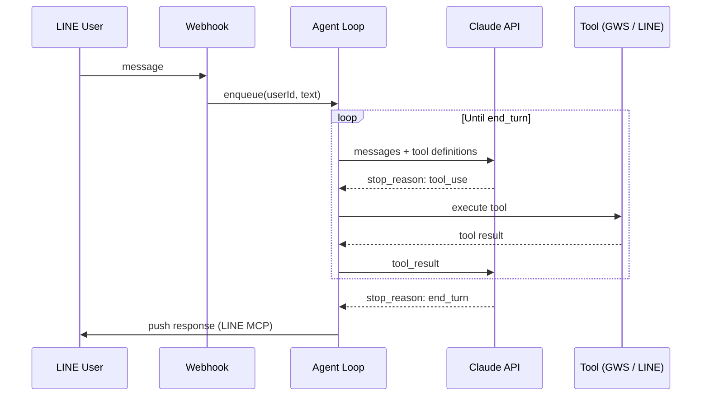
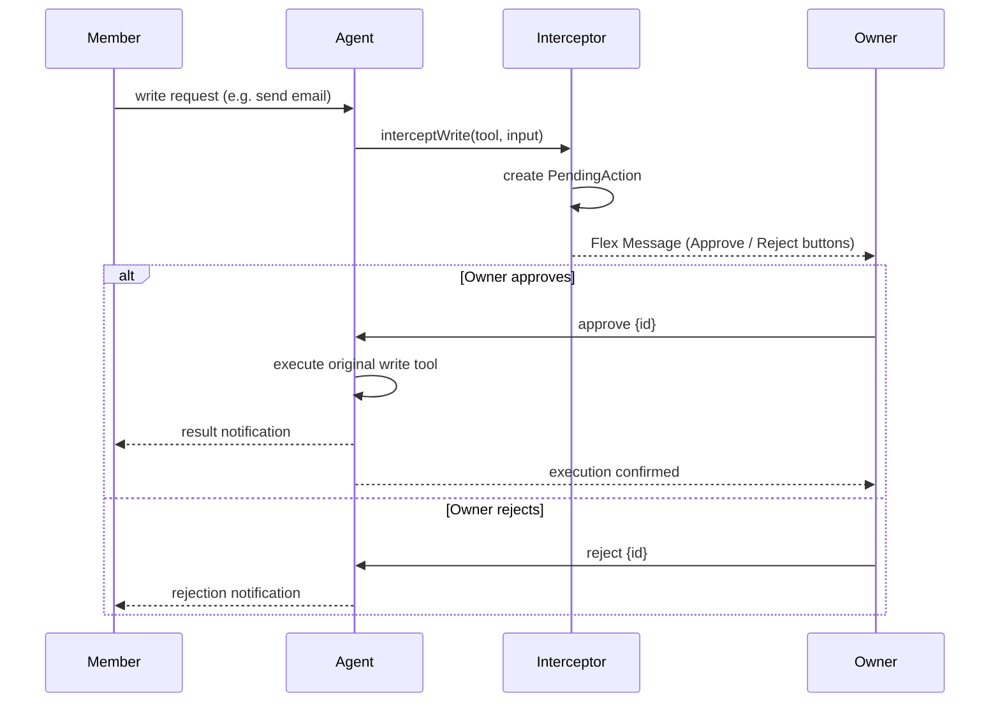

# sanalabo-automation

> **v1.0.0** — An agent server that operates Google Workspace through Claude API's `tool_use`.
> Uses LINE as the user input channel with a workspace-based multi-tenant architecture.

---

## Architecture


### Key Concepts

| Term | Description |
|------|-------------|
| **Workspace** | A unit combining a GWS account with a member group |
| **Owner** | Workspace creator with full GWS read/write access |
| **Member** | Workspace member; write operations require Owner approval |
| **System Admin** | System-wide administrator for workspace provisioning |

### Agent Loop

Not an intent router — Claude autonomously decides which tools to invoke each turn.



### Write Approval Flow

Member write operations are intercepted and require Owner approval before execution.



---

## Tech Stack

| Layer | Technology |
|-------|-----------|
| Runtime | [Bun](https://bun.sh/) |
| Framework | [Hono](https://hono.dev/) |
| Language | TypeScript (strict mode, ESM) |
| AI | `@anthropic-ai/sdk` — `tool_use` based agent loop |
| Validation | Zod 4 — single source of truth for tool input schemas |
| GWS Skill | `googleapis` + `google-auth-library` — Native Tool (in-process) |
| LINE Skill | `@line/line-bot-mcp-server` — MCP Tool |
| MCP Transport | Connection Pool (N stdio processes, least-inflight dispatch) |
| Logging | LogTape — structured logging, env-controlled level |
| Scheduler | Croner |
| Deploy | Docker Compose (`oven/bun:alpine`) |
| Tunnel | Cloudflare Tunnel |

---

## Project Structure

The codebase follows **Functional Core / Imperative Shell** — pure logic in `domain/`, I/O in every other layer.

```mermaid
flowchart TB
    subgraph Shell["Imperative Shell — I/O"]
        direction LR
        ENTRY["Entrypoint<br/><code>app.ts</code> · <code>config.ts</code> · <code>scheduler.ts</code>"]
        CHANNEL["Channel<br/><code>channels/line.ts</code>"]
        ROUTES["Routes<br/><code>routes/lineWebhook</code> · <code>googleOAuth</code> · <code>health</code>"]
        JOBS["Cron Jobs<br/><code>jobs/index.ts</code>"]
    end

    subgraph Agent["Agent Core"]
        direction LR
        LOOP["Loop<br/><code>agent/loop.ts</code>"]
        DISPATCH["Dispatch + Filter Chain<br/><code>agent/dispatch</code> · <code>filter-chain</code>"]
        APICLIENT["Claude API<br/><code>agent/api-client</code> · <code>api-errors</code>"]
        PROMPT["System Prompt · Transcript<br/><code>agent/system</code> · <code>transcript</code>"]
        TOOLDEF["Tool Definition<br/><code>agent/tool-definition.ts</code> (Zod SoT)"]
    end

    subgraph Tools["Tool Implementations"]
        direction LR
        SYSTOOLS["System Tools<br/><code>agent/system-tools</code> · <code>infra-tools</code>"]
        GWSTOOLS["GWS Tools<br/><code>skills/gws/gmail-tools</code> · <code>calendar-tools</code> · <code>drive-tools</code>"]
        LINEADAPT["LINE MCP Adapter<br/><code>agent/line-tool-adapter.ts</code>"]
    end

    subgraph Infra["Skills · Storage · Transport"]
        direction LR
        GWSEXEC["GWS Executor<br/><code>skills/gws/executor</code> · <code>google-auth</code> · <code>api-helpers</code> · <code>access</code>"]
        TOKEN["Token Store · Crypto<br/><code>skills/gws/token-store</code> · <code>encryption</code> · <code>oauth-state</code>"]
        MCP["MCP Pool<br/><code>agent/mcp</code> · <code>mcp-pool</code>"]
        APPROVALS["Approvals<br/><code>approvals/interceptor</code> · <code>notify</code> · <code>store</code>"]
        STORES["Stores<br/><code>users/store</code> · <code>workspaces/store</code> · <code>migrate</code>"]
    end

    subgraph Core["Functional Core — <code>domain/</code>"]
        DOMAIN["<code>user</code> · <code>workspace</code> · <code>google-oauth</code> · <code>google-scopes</code>"]
    end

    Shell --> Agent
    Agent --> Tools
    Tools --> Infra
    Agent -. pure calls .-> Core
    Tools -. pure calls .-> Core
    Infra -. pure calls .-> Core
    Shell -. pure calls .-> Core
```



**Layer responsibilities**:

- **Shell** — HTTP entrypoint, LINE Webhook parsing, scheduled jobs. Performs I/O, enqueues events into the agent loop.
- **Agent Core** — Claude API calls, tool dispatch, filter/interceptor pipeline, transcript management.
- **Tools** — self-contained tool definitions (Zod schema + executor). Categorized as System / GWS / LINE-MCP.
- **Infra** — OAuth token storage (AES-256-GCM), MCP stdio pool, approval interception, domain store persistence.
- **Functional Core** (`domain/`) — pure functions with no I/O; depend only on types in `src/types.ts`. Every other layer calls into this, never the reverse.

---

## Workspace Management

Workspaces are managed through **System Tools** via the LINE agent conversation — not direct API endpoints. See [Workspace Tools Reference](./docs/reference/workspace-tools.md) for the full tool list, access rules, and user lifecycle.

---

## Documentation

| Guide | Description |
|-------|-------------|
| [Setup — Local Development](./docs/setup/local-development.md) | Step-by-step local environment setup |
| [Setup — Environment Variables](./docs/setup/environment-variables.md) | Full list of `.env` variables |
| [Testing](./docs/testing.md) | Unit, local smoke, and dev-server smoke tests |
| [Deployment — Docker](./docs/deployment/docker.md) | Docker Compose + Cloudflare Tunnel |
| [Deployment — Self-hosted Runner](./docs/deployment/runner.md) | GitHub Actions runner install, systemd, rotation |
| [Deployment — Vault](./docs/deployment/vault.md) | On-prem Vault backend for CI/CD secrets |
| [Deployment — CI Secrets](./docs/deployment/ci-secrets.md) | GitHub Environments / secret handling |
| [Reference — Workspace Tools](./docs/reference/workspace-tools.md) | System tools callable from the agent |
| [Reference — Agent Orchestration](./docs/reference/agent-orchestration-industry-comparison.md) | Industry comparison notes |

---

## Contributing

### Branch Strategy — Simplified Git-flow

Two long-lived branches (`main`, `develop`) plus short-lived feature branches.

- Feature / fix / docs branches are cut from `develop`
- Merge into `develop` via PR → auto-deployed to the test server
- `develop` → `main` via PR → auto-deployed to production (only route to `main`)
- All merges use **squash and merge** (linear history)

### Commit Convention

[Conventional Commits](https://www.conventionalcommits.org/) format:

```
<type>(<scope>): <description>
```

**Types**: `feat`, `fix`, `docs`, `chore`, `test`, `refactor`, `style`, `perf`, `ci`
**Scopes**: `agent`, `channel`, `skill`, `jobs`, `routes`, `config`, `workspaces`, `approvals`, `docker`

### Verification Before Merge

```bash
bun run typecheck    # Must pass
bun test             # Must pass
```

See [Testing](./docs/testing.md) for the full verification procedure.

---

## Claude Code Integration

This project includes `.claude/CLAUDE.md` with project-specific instructions for [Claude Code](https://claude.com/claude-code) collaboration. Contributors using Claude Code automatically receive project context, coding conventions, and safety rules.

---

## License

Private — Sana Labo
