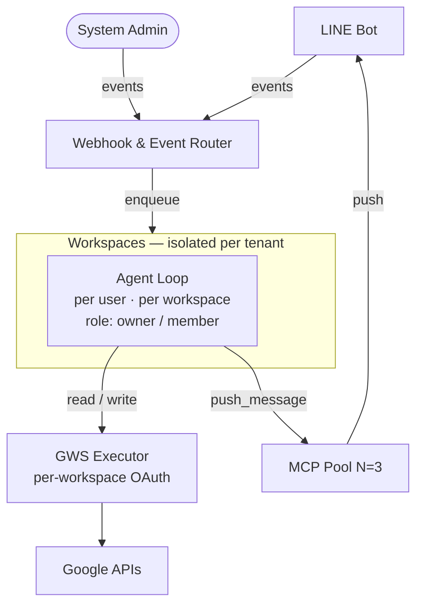
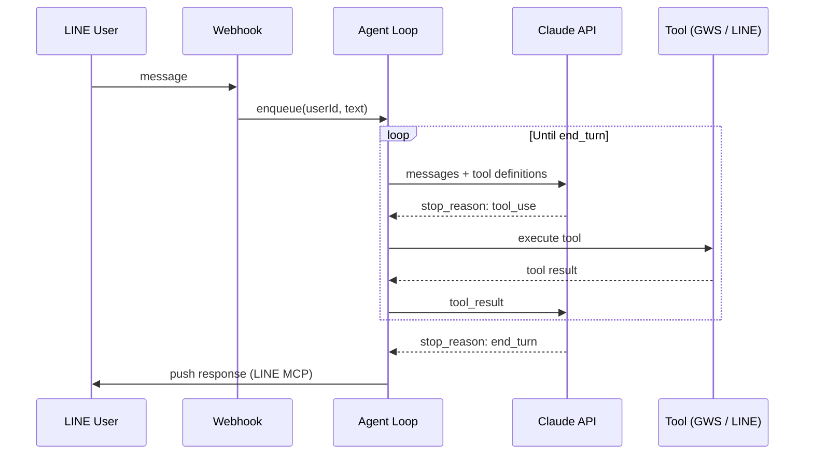
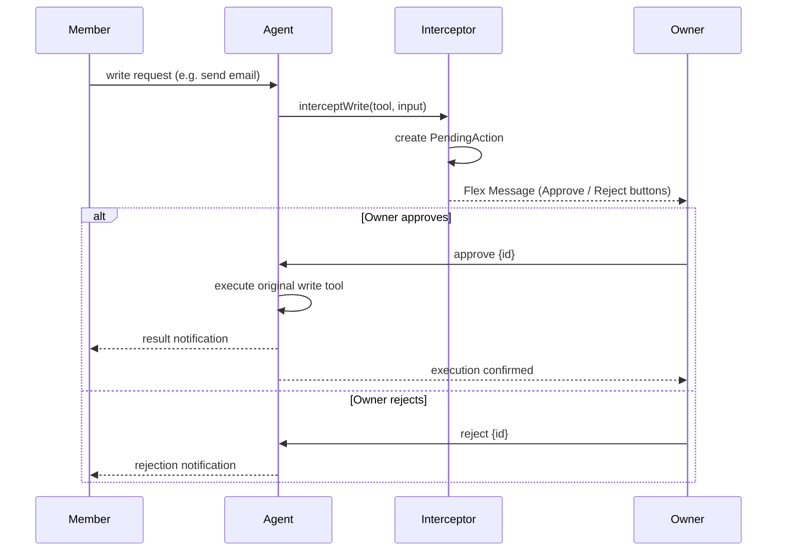
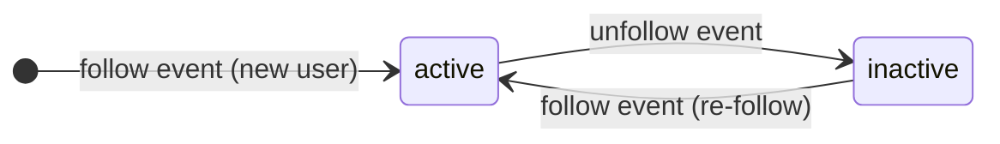

# sanalabo-automation

> **v1.0.0** — An agent server that operates Google Workspace through Claude API's `tool_use`.
> Uses LINE as the user input channel with a workspace-based multi-tenant architecture.

---

## Architecture



### Key Concepts

| Term | Description |
|------|-------------|
| **Workspace** | A unit combining a GWS account with a member group |
| **Owner** | Workspace creator with full GWS read/write access |
| **Member** | Workspace member; write operations require Owner approval |
| **System Admin** | System-wide administrator for workspace provisioning |

### Agent Loop

Not an intent router — Claude autonomously decides which tools to invoke each turn.



### Write Approval Flow

Member write operations are intercepted and require Owner approval before execution.



---

## Tech Stack

| Layer | Technology |
|-------|-----------|
| Runtime | [Bun](https://bun.sh/) |
| Framework | [Hono](https://hono.dev/) |
| Language | TypeScript (strict mode, ESM) |
| AI | `@anthropic-ai/sdk` — `tool_use` based agent loop |
| Validation | Zod 4 — single source of truth for tool input schemas |
| GWS Skill | `googleapis` + `google-auth-library` — Native Tool (in-process) |
| LINE Skill | `@line/line-bot-mcp-server` — MCP Tool |
| MCP Transport | Connection Pool (N stdio processes, least-inflight dispatch) |
| Logging | LogTape — structured logging, env-controlled level |
| Scheduler | Croner |
| Deploy | Docker Compose (`oven/bun:alpine`) |
| Tunnel | Cloudflare Tunnel |

---

## Local Development

### Prerequisites

| Requirement | Notes |
|-------------|-------|
| [Bun](https://bun.sh/) v1.0+ | JavaScript runtime |
| [ngrok](https://ngrok.com/) | Tunnel for LINE Webhook — free account, static domain required |
| LINE Messaging API channel | [LINE Developers Console](https://developers.line.biz/) |
| [Anthropic API key](https://console.anthropic.com/) | Claude access |
| Google Cloud OAuth 2.0 credentials | **Optional** — required only for Gmail / Calendar / Drive features |

> For Docker-based setup or production deployment → [docs/deployment/](docs/deployment/)

---

### Setup Overview

1. Clone & Install
2. Set Up ngrok Static Domain
3. Configure LINE Bot
4. Configure Google OAuth *(optional)*
5. Set Environment Variables
6. Start the Server
7. Get Your LINE User ID

---

### 1. Clone & Install

```bash
git clone https://github.com/sanalabo-org/sanalabo-automation.git
cd sanalabo-automation
bun install
```

---

### 2. Set Up ngrok Static Domain

A **static domain** persists across ngrok restarts, so you never need to update the LINE Webhook URL again.

1. Sign up at [ngrok.com](https://ngrok.com/)
2. Go to **Dashboard → Domains → New Domain** — a free static domain is generated automatically (format: `<random-name>.ngrok-free.app`)
3. Install the CLI and register your auth token:

```bash
# macOS
brew install ngrok

# Register your auth token (Dashboard → Your Authtoken)
ngrok config add-authtoken <AUTHTOKEN>
```

---

### 3. Configure LINE Bot

1. Open [LINE Developers Console](https://developers.line.biz/) → select your channel → **Messaging API** tab
2. Set **Webhook URL**:
   ```
   https://<your-static-domain>.ngrok-free.app/webhook/line
   ```
3. Enable **Use webhook**
4. Click **Verify** after the server is running to confirm connectivity

Copy the following values for your `.env`:

| Field | `.env` variable |
|-------|----------------|
| Channel access token (long-lived) | `LINE_CHANNEL_ACCESS_TOKEN` |
| Channel secret | `LINE_CHANNEL_SECRET` |

---

### 4. Configure Google OAuth *(optional — GWS features only)*

Skip this step if you do not need Gmail, Calendar, or Drive features.

**① Enable APIs**

In [Google Cloud Console](https://console.cloud.google.com/) → **APIs & Services → Library**, enable:
- Gmail API
- Google Calendar API
- Google Drive API

**② Create OAuth 2.0 Credentials**

1. **APIs & Services → OAuth consent screen** — set app name, support email, and add the required scopes. Add your Google account as a test user.
2. **Credentials → Create Credentials → OAuth 2.0 Client ID**
   - Application type: **Web application**
   - Authorized redirect URIs:
     ```
     https://<your-static-domain>.ngrok-free.app/auth/google/callback
     ```
3. Copy the **Client ID** and **Client Secret**

**③ Generate an encryption key**

Token storage uses AES-256-GCM encryption. Generate a 32-byte master key:

```bash
node -e "console.log(require('crypto').randomBytes(32).toString('hex'))"
```

---

### 5. Set Environment Variables

```bash
cp .env.example .env
```

Open `.env` and fill in the required values:

```dotenv
# Required
ANTHROPIC_API_KEY=sk-ant-...
LINE_CHANNEL_ACCESS_TOKEN=...
LINE_CHANNEL_SECRET=...
SYSTEM_ADMIN_IDS=U...              # Your LINE userId (see Step 7)

# GWS features only (optional)
GOOGLE_CLIENT_ID=...
GOOGLE_CLIENT_SECRET=...
GOOGLE_REDIRECT_URI=https://<your-static-domain>.ngrok-free.app/auth/google/callback
TOKEN_ENCRYPTION_KEY=...           # 64-char hex string from Step 4③
```

See the full list of variables in the [Environment Variables](#environment-variables) section.

---

### 6. Start the Server

**Terminal 1** — app server:

```bash
bun run dev
```

**Terminal 2** — ngrok tunnel:

```bash
ngrok http --domain=<your-static-domain>.ngrok-free.app 3000
```

Verify the server is running:

```bash
curl http://localhost:3000/health
```

---

### 7. Get Your LINE User ID

You need your LINE `userId` to set `SYSTEM_ADMIN_IDS`. Here is how to find it:

1. Add `LOG_LEVEL=debug` to `.env`
2. Restart `bun run dev`
3. Send any message to your LINE Bot
4. Find the `userId` in server logs:
   ```
   { userId: "Uxxxxxxxxxx...", eventType: "message", ... }
   ```
5. Set `SYSTEM_ADMIN_IDS` in `.env` to that value and restart the server
6. Remove `LOG_LEVEL=debug` once confirmed

---

## Environment Variables

| Variable | Required | Description |
|----------|----------|-------------|
| `ANTHROPIC_API_KEY` | Yes | Claude API key |
| `LINE_CHANNEL_ACCESS_TOKEN` | Yes | LINE Messaging API access token |
| `LINE_CHANNEL_SECRET` | Yes | LINE channel secret for HMAC-SHA256 signature verification |
| `SYSTEM_ADMIN_IDS` | Yes | System admin LINE userIds (comma-separated) |
| `GOOGLE_CLIENT_ID` | GWS only | Google Cloud OAuth 2.0 Client ID |
| `GOOGLE_CLIENT_SECRET` | GWS only | Google Cloud OAuth 2.0 Client Secret |
| `GOOGLE_REDIRECT_URI` | GWS only | OAuth redirect URI — must match the value in Google Cloud Console |
| `TOKEN_ENCRYPTION_KEY` | GWS only | AES-256-GCM master key (32 bytes = 64 hex chars) |
| `CF_TUNNEL_TOKEN` | Docker only | Cloudflare Tunnel token |
| `PORT` | No | Server port (default: `3000`) |
| `MCP_POOL_SIZE` | No | MCP connection pool size (default: `3`) |
| `AGENT_MODEL` | No | Agent model ID (default: `claude-haiku-4-5-20251001`) |
| `AGENT_MAX_TOKENS` | No | Max tokens per turn — auto-queried from Models API if unset |
| `AGENT_MAX_TURNS` | No | Max tool-call turns per session (default: `15`) |
| `AGENT_MAX_TOKEN_RETRIES` | No | Auto-resume count on `max_tokens` stop reason (default: `3`) |
| `AGENT_COMPACT_MODEL` | No | *(planned)* Model used for context compaction (default: `claude-sonnet-4-6`) |
| `AGENT_COMPACT_MAX_TOKENS` | No | *(planned)* Max tokens for compaction — auto-queried from Models API if unset |
| `LOG_LEVEL` | No | `debug` / `info` / `warning` / `error` (default: `info`) |
| `USER_STORE_PATH` | No | User store file path (default: `data/users.json`) |
| `WORKSPACE_STORE_PATH` | No | Workspace store file path (default: `data/workspaces.json`) |
| `PENDING_ACTION_STORE_PATH` | No | Pending action store file path (default: `data/pending-actions.json`) |
| `WORKSPACE_DATA_DIR` | No | Workspace data directory (default: `data/workspaces`) |

---

## Project Structure

```
src/
├── channels/line.ts              # LINE Webhook (signature verification, event parsing)
├── agent/
│   ├── loop.ts                   # tool_use agent loop
│   ├── system.ts                 # System prompt (workspace + role aware)
│   ├── system-tools.ts           # System Tools (workspace CRUD via agent)
│   ├── tool-definition.ts        # ToolDefinition structure + Zod single source of truth
│   ├── line-tool-adapter.ts      # LINE MCP Tool → simplified schema adapter
│   ├── mcp.ts                    # MCP client singleton
│   └── mcp-pool.ts               # MCP connection pool (least-inflight dispatch)
├── users/store.ts                # User store (follow → active → inactive)
├── workspaces/
│   ├── store.ts                  # Workspace store (CRUD, member management)
│   └── migrate.ts                # Legacy flat model migration
├── approvals/
│   ├── store.ts                  # PendingAction store
│   ├── interceptor.ts            # Write interception (member → owner approval)
│   └── notify.ts                 # Owner notification (Flex / Text message)
├── skills/gws/
│   ├── tools.ts                  # GWS tool definitions (Zod schemas)
│   ├── executor.ts               # OAuth executor factory + caching
│   ├── access.ts                 # Access control (read / write classification)
│   ├── google-auth.ts            # OAuth2Client helpers
│   ├── token-store.ts            # Encrypted token storage
│   └── oauth-state.ts            # One-time OAuth state management
├── domain/                       # Functional Core — pure functions, no I/O
├── jobs/index.ts                 # Cron jobs (morning briefing, urgent mail, etc.)
├── routes/
│   ├── lineWebhook.ts            # POST /webhook/line
│   ├── googleOAuth.ts            # GET /auth/google/callback
│   └── health.ts                 # GET /health
├── utils/
│   ├── json-file-store.ts        # Abstract JSON file store base class
│   ├── logger.ts                 # LogTape wrapper
│   └── error.ts                  # Error utilities
├── test-utils/                   # Shared test helpers
├── scheduler.ts                  # Croner job registration
├── config.ts                     # Environment variable parsing + validation
├── app.ts                        # Hono entrypoint + DI wiring
└── types.ts                      # Shared types + Store interfaces
```

---

## Workspace Management

Workspaces are managed through **System Tools** via the LINE agent conversation.

### Workspace & Navigation

| Tool | Who | Description |
|------|-----|-------------|
| `create_workspace` | Any user | Create a new workspace (1 per user; admins can specify `owner_user_id`) |
| `list_workspaces` | Any user | List workspaces (admin: all; regular user: owned only) |
| `get_workspace_info` | Any user | View workspace details |
| `enter_workspace` | Any member | Enter a workspace to start working — GWS tools become available after entering |
| `leave_workspace` | Any member | Leave the current workspace and return to workspace selection |

### Member Management

| Tool | Who | Description |
|------|-----|-------------|
| `invite_member` | Owner / Admin | Invite a user by LINE userId — added as member immediately |

### Approval Flow

| Tool | Who | Description |
|------|-----|-------------|
| `approve_action` | Owner | Approve a pending write action from a member — executes immediately and notifies the requester |
| `reject_action` | Owner | Reject a pending write action — notifies the requester with an optional reason |

### Google Workspace Authentication

| Tool | Who | Description |
|------|-----|-------------|
| `authenticate_gws` | Owner / Admin | Send a Google OAuth link for initial or full re-authentication |
| `request_gws_scopes` | Owner / Admin | Request additional permissions for missing service scopes only (Gmail, Calendar, or Drive) |

### User Lifecycle



---

## Testing

```bash
bun test                              # Run all tests
bun test src/utils/error.test.ts      # Run a specific file
bun run typecheck                     # Type check (tsc --noEmit)
```

Tests are co-located with source files (`*.test.ts`) following the TDD methodology (Red → Green → Refactor).

| Category | Scope | Strategy |
|----------|-------|----------|
| Pure logic | `domain/*`, access, error, LINE parsing, system prompt | Direct calls, no mocks |
| Store I/O | `JsonFileStore`, `UserStore`, `WorkspaceStore`, `PendingActionStore` | Real file I/O with `$TMPDIR` |
| Business logic | interceptor, notifications, executor caching | Mock stores / registries |
| HTTP | health route, OAuth callback | Hono `app.request()` |

---

## Contributing

### Branch Strategy

All work is done on **feature branches** — direct commits to `main` are prohibited.
Branch from `main` → PR review → squash and merge (linear history) → delete branch.

### Commit Convention

[Conventional Commits](https://www.conventionalcommits.org/) format:

```
<type>(<scope>): <description>
```

**Types**: `feat`, `fix`, `docs`, `chore`, `test`, `refactor`, `style`, `perf`, `ci`

**Scopes**: `agent`, `channel`, `skill`, `jobs`, `routes`, `config`, `workspaces`, `approvals`, `docker`

### Verification Before Merge

```bash
bun run typecheck    # Must pass
bun test             # Must pass
```

---

## Deployment

This project uses Docker Compose + Cloudflare Tunnel for all deployment environments.

| Guide | Description |
|-------|-------------|
| [docs/deployment/docker.md](docs/deployment/docker.md) | Docker Compose configuration and Cloudflare Tunnel setup |
| [docs/deployment/production.md](docs/deployment/production.md) | Production server setup (Hetzner Cloud recommended) |

---

## Claude Code Integration

This project includes `.claude/CLAUDE.md` with project-specific instructions for [Claude Code](https://claude.com/claude-code) collaboration. Contributors using Claude Code will automatically receive project context, coding conventions, and safety rules.

---

## License

Private — Sana Labo
