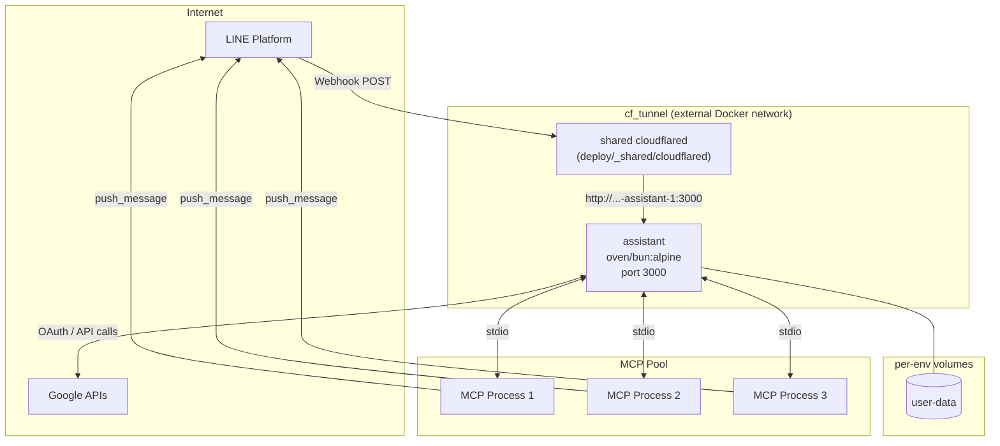

# Docker Compose Deployment

This guide covers the Docker Compose configuration for the application container and day-to-day operations. Public HTTPS exposure is handled by a **shared Cloudflare tunnel** running as an independent compose project — see [`deploy/_shared/cloudflared/`](../../deploy/_shared/cloudflared/README.md).

---

## Service Architecture

`docker-compose.yml` defines only the `assistant` service. It joins the external `cf_tunnel` Docker network so the shared cloudflared container can reach it by container name.



| Service | Image | Role |
|---------|-------|------|
| `assistant` | `oven/bun:1-alpine` (built locally) | Hono app server |

Cloudflared runs separately, routing `agent-dev.sanalabo.com` and `agent.sanalabo.com` to the dev/prod assistant containers respectively via `config.yml` ingress entries.

---

## Prerequisites

- [Docker](https://docs.docker.com/get-docker/) + Docker Compose v2
- A configured `.env` file (see [Environment Variables](../../README.md#environment-variables))
- **External network `cf_tunnel`** exists on the host (`docker network create cf_tunnel`)
- Shared cloudflared tunnel **running** — see [`deploy/_shared/cloudflared/README.md`](../../deploy/_shared/cloudflared/README.md)

---

## Cloudflare Tunnel

The tunnel is **locally managed** (config-as-code via `config.yml` + `creds.json`) and **shared** across every service and environment on the host. This means:

- Adding a service or environment = one `ingress` entry in `config.yml`, no new container
- `docker compose up -d` on the app does **not** restart cloudflared → no LINE webhook gap during redeploys
- Routing changes are auditable via Git

For setup, rotation, and hostname addition procedures, see [`deploy/_shared/cloudflared/README.md`](../../deploy/_shared/cloudflared/README.md).

---

## Running

```bash
# Build image and start all services
docker compose up -d --build

# Stream logs
docker compose logs -f

# Check service status
docker compose ps

# Verify app server health
curl http://localhost:3000/health
```

---

## Data Persistence

All application data is stored in the `user-data` named Docker volume:

```
data/
├── users.json                    # User records
├── workspaces.json               # Workspace records
├── pending-actions.json          # Pending approval actions
└── workspaces/<workspace-id>/    # Per-workspace encrypted OAuth tokens
```

> **Warning:** `docker compose down -v` deletes the volume and all stored data. Use only when a full reset is intended.

---

## GWS Authentication

After the server is running, connect a Google account to a workspace by sending the `authenticate_gws` command to the LINE Bot. The agent will reply with an OAuth authorization link. Complete the flow in your browser — the token is stored and encrypted automatically.

---

## Updating

```bash
git pull
docker compose up -d --build
docker image prune -f
```

---

## Troubleshooting

**`ERROR: network cf_tunnel declared as external, but could not be found`**

The shared Docker network has not been created yet. On the host:

```bash
docker network create cf_tunnel
```

This is a one-time per-host action. Re-run `docker compose up -d` after.

**Tunnel hostname returns 530 / Cloudflare error**

The shared cloudflared container is not running or cannot reach the assistant container. Check:

```bash
# Is cloudflared up?
docker ps --filter 'name=sanalabo-shared-cloudflared'

# Are assistant and cloudflared on the same network?
docker network inspect cf_tunnel | grep -E 'Name|Containers' -A1

# Tunnel logs
docker compose -f deploy/_shared/cloudflared/docker-compose.yml logs --tail=50
```

**Port 3000 conflict on the host**

By default, port 3000 is not exposed to the host — cloudflared reaches the assistant over the internal `cf_tunnel` network. If you need host access for debugging, add to `docker-compose.yml`:

```yaml
services:
  assistant:
    ports:
      - "3000:3000"
```
