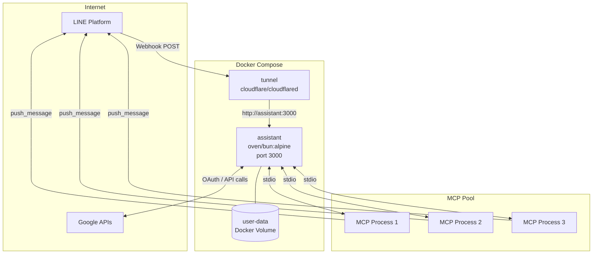
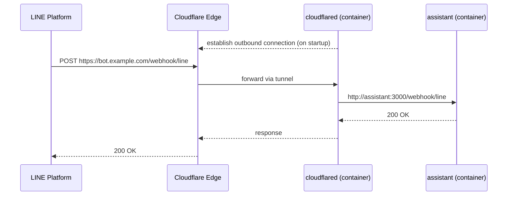

# Docker Compose Deployment

This guide covers the Docker Compose configuration, Cloudflare Tunnel setup, and day-to-day operations.

---

## Service Architecture

`docker-compose.yml` defines two services. The `tunnel` service only starts after `assistant` passes its health check.



| Service | Image | Role |
|---------|-------|------|
| `assistant` | `oven/bun:1-alpine` (built locally) | Hono app server |
| `tunnel` | `cloudflare/cloudflared:latest` | Public HTTPS endpoint for LINE Webhook |

---

## Prerequisites

- [Docker](https://docs.docker.com/get-docker/) + Docker Compose v2
- A configured `.env` file (see [Environment Variables](../../README.md#environment-variables))
- A Cloudflare Tunnel token (`CF_TUNNEL_TOKEN`)

---

## Cloudflare Tunnel Setup

Cloudflare Tunnel exposes the local app server to the internet without opening inbound ports on the host machine.

### How it works



### Creating a Tunnel

1. Log in to [Cloudflare Zero Trust](https://one.dash.cloudflare.com/)
2. Navigate to **Networks → Tunnels → Create a tunnel**
3. Select **Cloudflared** as the connector type
4. Enter a tunnel name (e.g., `sanalabo-bot`) and copy the generated **tunnel token**
5. Set the token in `.env`:
   ```dotenv
   CF_TUNNEL_TOKEN=<your-tunnel-token>
   ```

### Configuring Public Hostname

In the tunnel settings, add a public hostname:

| Field | Value |
|-------|-------|
| Subdomain | e.g., `bot` |
| Domain | Your Cloudflare-managed domain |
| Service | `http://assistant:3000` |

Your public URL will be: `https://<subdomain>.<domain>`

### Updating External Services

After the tunnel is configured, update the Webhook / OAuth URLs in the respective consoles:

**LINE Bot Webhook URL** ([LINE Developers Console](https://developers.line.biz/) → Messaging API):
```
https://<subdomain>.<domain>/webhook/line
```

**Google OAuth Redirect URI** ([Google Cloud Console](https://console.cloud.google.com/) → Credentials → OAuth 2.0 Client ID) and `.env`:
```
https://<subdomain>.<domain>/auth/google/callback
```

---

## Running

```bash
# Build image and start all services
docker compose up -d --build

# Stream logs
docker compose logs -f

# Check service status
docker compose ps

# Verify app server health
curl http://localhost:3000/health
```

---

## Data Persistence

All application data is stored in the `user-data` named Docker volume:

```
data/
├── users.json                    # User records
├── workspaces.json               # Workspace records
├── pending-actions.json          # Pending approval actions
└── workspaces/<workspace-id>/    # Per-workspace encrypted OAuth tokens
```

> **Warning:** `docker compose down -v` deletes the volume and all stored data. Use only when a full reset is intended.

---

## GWS Authentication

After the server is running, connect a Google account to a workspace by sending the `authenticate_gws` command to the LINE Bot. The agent will reply with an OAuth authorization link. Complete the flow in your browser — the token is stored and encrypted automatically.

---

## Updating

```bash
git pull
docker compose up -d --build
docker image prune -f
```

---

## Troubleshooting

**`tunnel` service does not start**

The `tunnel` service depends on `assistant` being healthy. Check the app server logs first:

```bash
docker compose logs assistant
```

**Port 3000 conflict on the host**

By default, port 3000 is not exposed to the host — communication is internal between containers. If you need host access for debugging, add to `docker-compose.yml`:

```yaml
services:
  assistant:
    ports:
      - "3000:3000"
```
