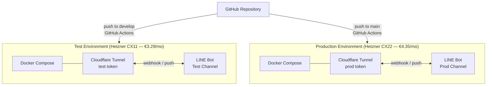
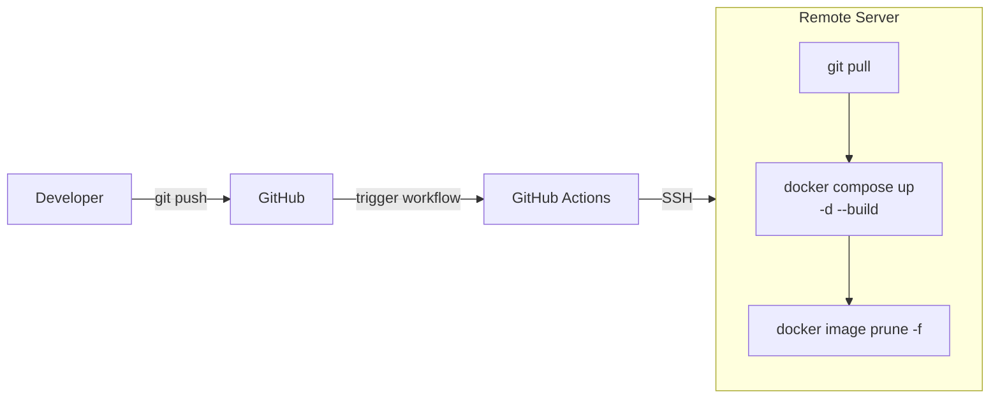

# Production Deployment Guide

This guide covers selecting a server platform, setting up a production environment, and optionally configuring automated deployments via GitHub Actions.

---

## Platform Selection

This project requires a **long-running process** (MCP connection pool, in-memory user queues) and cannot run on serverless platforms. Cloudflare Tunnel handles HTTPS termination, so no domain or TLS certificate configuration is needed on the server itself.

| Platform | Spec | Monthly Cost | Notes |
|----------|------|-------------|-------|
| **Hetzner Cloud CX22** (recommended) | 2 vCPU / 4 GB RAM / 40 GB SSD | €4.35 | Best value, x86 |
| Hetzner Cloud CAX11 | 2 vCPU / 4 GB RAM / 40 GB SSD | €4.51 | ARM64 variant |
| Hetzner Cloud CX11 (test only) | 2 vCPU / 2 GB RAM / 20 GB SSD | €3.29 | Sufficient for a test environment |
| DigitalOcean Droplet (Basic) | 1 vCPU / 1 GB RAM / 25 GB SSD | $6.00 | Familiar UX, good documentation |

> AWS EC2 is significantly more expensive for equivalent specs and adds unnecessary operational complexity at this scale.

---

## Environment Topology

The recommended setup uses two independent servers — one for testing, one for production.



Each environment maintains its own independent `.env`, Cloudflare Tunnel token, and LINE Bot channel. Production secrets are managed directly on the server and are never committed to the repository.

---

## Hetzner Cloud Server Setup

### 1. Create the Server

1. Open [Hetzner Cloud Console](https://console.hetzner.cloud/) → **New Server**
2. Configure as follows:

| Setting | Recommended Value |
|---------|------------------|
| Location | Falkenstein or Helsinki |
| Image | Ubuntu 24.04 |
| Type | CX22 (x86) for production, CX11 for test |
| SSH key | Select your pre-registered public key |

3. Note the assigned server IP address.

### 2. Install Docker

SSH into the server, then run:

```bash
# Official Docker install script (Ubuntu 24.04)
curl -fsSL https://get.docker.com | sh

# Add your user to the docker group
sudo usermod -aG docker $USER

# Re-login for the group change to take effect, then verify
docker --version
docker compose version
```

### 3. Deploy the Application

```bash
# Clone the repository
git clone https://github.com/sanalabo-org/sanalabo-automation.git
cd sanalabo-automation

# Configure environment variables
cp .env.example .env
nano .env        # or: vim .env

# Build and start all services
docker compose up -d --build

# Verify everything is running
docker compose ps
docker compose logs -f
```

### 4. Configure Cloudflare Tunnel

Follow the steps in [docs/deployment/docker.md → Cloudflare Tunnel Setup](docker.md#cloudflare-tunnel-setup) to create a tunnel and configure the public hostname.

### 5. Firewall Configuration

LINE Webhook traffic flows through Cloudflare Tunnel, so HTTP/HTTPS ports do not need to be exposed directly. Only SSH needs to be open.

In **Hetzner Cloud Console → Firewalls → Create Firewall**, add one inbound rule:

| Direction | Protocol | Port | Source |
|-----------|----------|------|--------|
| Inbound | TCP | 22 | Any IPv4, Any IPv6 |

---

## GitHub Actions CI/CD (Optional)

Automate deployments on every push with the following workflow configuration.

### Deployment Flow



### Configure Secrets

In your repository, go to **Settings → Secrets and variables → Actions** and add:

| Secret | Value |
|--------|-------|
| `PROD_SERVER_HOST` | Production server IP address |
| `PROD_SERVER_USER` | SSH username (e.g., `root`) |
| `PROD_SERVER_SSH_KEY` | Full contents of the SSH private key |
| `TEST_SERVER_HOST` | Test server IP address |
| `TEST_SERVER_USER` | SSH username |
| `TEST_SERVER_SSH_KEY` | SSH private key for test server |

### Workflow Files

**`.github/workflows/deploy-prod.yml`** — triggers on push to `main`:

```yaml
name: Deploy to Production

on:
  push:
    branches: [main]

jobs:
  deploy:
    runs-on: ubuntu-latest
    steps:
      - name: Deploy to production server
        uses: appleboy/ssh-action@v1
        with:
          host: ${{ secrets.PROD_SERVER_HOST }}
          username: ${{ secrets.PROD_SERVER_USER }}
          key: ${{ secrets.PROD_SERVER_SSH_KEY }}
          script: |
            cd /root/sanalabo-automation
            git pull origin main
            docker compose up -d --build
            docker image prune -f
```

**`.github/workflows/deploy-test.yml`** — triggers on push to `develop`:

```yaml
name: Deploy to Test

on:
  push:
    branches: [develop]

jobs:
  deploy:
    runs-on: ubuntu-latest
    steps:
      - name: Deploy to test server
        uses: appleboy/ssh-action@v1
        with:
          host: ${{ secrets.TEST_SERVER_HOST }}
          username: ${{ secrets.TEST_SERVER_USER }}
          key: ${{ secrets.TEST_SERVER_SSH_KEY }}
          script: |
            cd /root/sanalabo-automation
            git pull
            docker compose up -d --build
            docker image prune -f
```

---

## Server Maintenance

```bash
# View live logs
docker compose logs -f

# Restart all services
docker compose restart

# Stop all services (data preserved)
docker compose down

# Manual update
git pull && docker compose up -d --build && docker image prune -f
```
