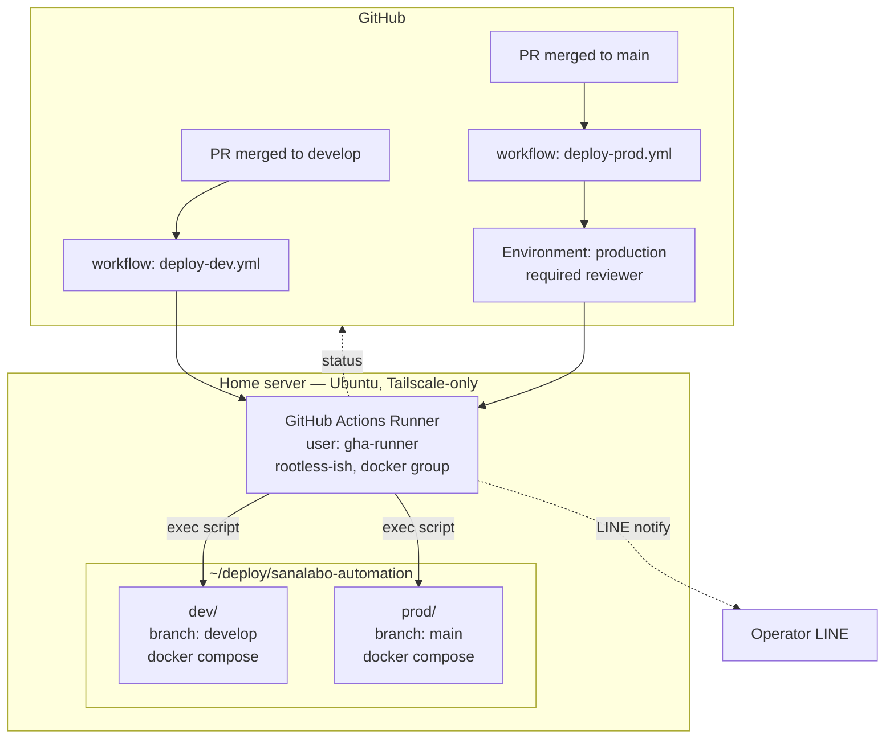

# Phase 4 — CI/CD Design (GitHub Actions Self-hosted Runner)

**Status:** Proposal — pending review
**Target environment:** On-premise home server (Ubuntu, Tailscale-only, `ssh timothy-dev-ts`)
**Supersedes:** The "GitHub Actions CI/CD (Optional)" section in [deployment/production.md](../deployment/production.md) for the home-server topology. The Hetzner/cloud variant in that guide remains valid for future external deployments.

---

## 1. Goals

1. **Zero-touch deploy**: `git push` to `develop` → dev auto-deploy; merge to `main` → prod deploy with approval gate.
2. **Fast rollback**: revert to any previous deployed revision in ≤ 1 minute.
3. **Multi-service ready**: The first service (sanalabo-automation) must set a repeatable pattern — adding a new service repo should reuse the same runner and deploy script with minimal edits.
4. **Safe secrets**: no secrets in git, no secrets in workflow logs, server `.env` managed from GitHub Secrets.
5. **Observability**: deploy success/failure surfaced in LINE (operator notifications) and in the GitHub Actions UI.

## 2. Non-goals (explicitly out of scope)

- Kubernetes / K3s migration. Tracked in the [homelab roadmap](../../.claude/MEMORY.md) — planned once service count passes ~3–5.
- Jenkins-based independent CI. Option C; revisit when the team grows beyond the current single maintainer.
- Blue/green or canary at the load-balancer level. Current topology is single-instance + Cloudflare Tunnel; rolling restart is the practical equivalent.
- Cross-server replication / HA.

## 3. Why self-hosted runner (recap)

The home server is reachable **only via Tailscale**. A GitHub-hosted runner cannot SSH into it without either:
- installing Tailscale in the runner each job (slow, brittle, token leaks in logs), or
- exposing SSH publicly (undesirable).

A self-hosted runner on the server itself eliminates the network problem and removes the SSH-from-cloud attack surface entirely.

## 4. Architecture overview



### Deployment flow per push

```
[Push event]
  → [Runner picks job]
  → [checkout repo at target SHA into ~/deploy/<env>]
  → [inject .env from GitHub Secrets → ~/deploy/<env>/.env]
  → [docker compose build (tagged with SHA)]
  → [docker compose up -d (rolling)]
  → [healthcheck: curl -f http://localhost:3000/health, 3 retries]
  → [pass] : tag current as "last-good-<env>", notify success
  → [fail] : rollback to previous "last-good-<env>", notify failure
```

## 5. Components

### 5.1 Self-hosted runner installation

**Location:** `/opt/actions-runner/` owned by a dedicated system user.

**Dedicated user rationale:** Isolate runner from `timothy01` (personal account) so a compromised workflow cannot read personal SSH keys, shell history, or user-level dotfiles.

```
user:    gha-runner       (system user, no login shell OR restricted shell)
groups:  gha-runner, docker
home:    /opt/actions-runner
```

**Why `docker` group?** The runner must invoke `docker compose` against the system daemon. The alternative — rootless Docker in the runner — is cleaner isolation but doubles complexity (separate daemon, separate networks, cloudflared sharing becomes awkward). We accept the shared-daemon compromise and mitigate via job-scoped directories and secret hygiene. Re-evaluate if we migrate to K3s (which changes the runtime model anyway).

**Registration scope:** Organization-level runner with a **label** (`home-server`). Future service repos in the same org pick it up by the `runs-on: [self-hosted, home-server]` label. Repo-level runner is too narrow for the multi-service goal.

**Auto-start:** systemd service (`actions.runner.<org>.<name>.service`, auto-generated by `./svc.sh install`).

### 5.2 Directory layout on server

```
/opt/actions-runner/                 # runner binary + config, owned by gha-runner
~gha-runner/deploy/
  sanalabo-automation/
    dev/                             # separate clone, branch: develop
      .env                           # populated by workflow from GitHub Secrets
      docker-compose.yml
      ...
    prod/                            # separate clone, branch: main
      .env
      ...
  <next-service>/                    # future: same pattern
    dev/
    prod/
```

The runner runs as `gha-runner`, but the deploy directories can either live under `gha-runner`'s home (cleaner) or stay at `~timothy01/deploy/` (current layout) with `gha-runner` given group write access. **Decision needed** — see §9 open questions.

### 5.3 Secret management

**GitHub Secrets** (per-environment):

| Secret | Scope | Used for |
|--------|-------|----------|
| `DEV_ENV_FILE` | environment: `dev` | Full `.env` contents for dev |
| `PROD_ENV_FILE` | environment: `prod` | Full `.env` contents for prod |
| `LINE_NOTIFY_CHANNEL_TOKEN` | repository | Operator notifications |
| `OPERATOR_LINE_USER_ID` | repository | Notification target |

Workflow writes `DEV_ENV_FILE` contents to `~/deploy/sanalabo-automation/dev/.env` with `chmod 600` immediately before `docker compose up`. The file is never echoed to logs (`::add-mask::` on each line during render, or write via stdin redirection).

**Rotation:** updating the secret in GitHub and re-running the latest successful workflow re-populates `.env`. No server login needed for credential rotation — important UX win.

### 5.4 Workflow files

Three files under `.github/workflows/`:

| File | Trigger | Env |
|------|---------|-----|
| `check-source-branch.yml` | PR → main | (existing, unchanged) |
| `deploy-dev.yml` | push → develop | environment: `dev` |
| `deploy-prod.yml` | push → main | environment: `prod` (with required reviewer) |

**`deploy-dev.yml` skeleton:**

```yaml
name: Deploy to dev
on:
  push:
    branches: [develop]
concurrency:
  group: deploy-dev
  cancel-in-progress: false   # finish current before next starts
jobs:
  deploy:
    runs-on: [self-hosted, home-server]
    environment: dev
    steps:
      - name: Checkout into deploy dir
        run: |
          cd ~/deploy/sanalabo-automation/dev
          git fetch origin develop
          git reset --hard origin/develop
      - name: Render .env
        run: |
          umask 077
          printf '%s' '${{ secrets.DEV_ENV_FILE }}' > ~/deploy/sanalabo-automation/dev/.env
      - name: Record previous image digest (for rollback)
        id: prev
        run: |
          cd ~/deploy/sanalabo-automation/dev
          echo "digest=$(docker compose images -q assistant | head -1)" >> $GITHUB_OUTPUT
      - name: Build & up
        run: |
          cd ~/deploy/sanalabo-automation/dev
          docker compose build --pull
          docker compose up -d
      - name: Healthcheck
        run: |
          for i in 1 2 3 4 5 6; do
            if docker exec dev-assistant-1 bun -e "fetch('http://localhost:3000/health').then(r=>{if(!r.ok)process.exit(1)})"; then
              exit 0
            fi
            sleep 10
          done
          exit 1
      - name: Rollback on failure
        if: failure() && steps.prev.outputs.digest != ''
        run: |
          cd ~/deploy/sanalabo-automation/dev
          docker tag ${{ steps.prev.outputs.digest }} dev-assistant:rollback
          docker compose up -d   # compose recreates from tagged image
      - name: Notify LINE
        if: always()
        run: |
          # call LINE push API with status, commit, job URL
          ...
```

`deploy-prod.yml` is structurally identical with `environment: prod` (which in GitHub Settings has `required_reviewers: [timothy-20]`). The reviewer approval gate is **free for public repos and for org members** — no paid plan needed for single-reviewer gating.

### 5.5 Rollback strategy

Two layers:

1. **Automatic (in-workflow):** recorded "previous image digest" before build. On healthcheck failure, retag and `compose up` reverts. Time to recovery: ~15 s.
2. **Manual (operator-initiated):** `workflow_dispatch` with input `revision: <sha>`. Re-runs the same deploy workflow but checks out that SHA. Useful when a deployed bug is discovered later.

Image retention: `docker image prune --force --filter "until=168h"` (keep 7 days) runs at the end of each successful deploy. Tagged rollback images are protected by tag.

### 5.6 Notifications

Reuse the existing LINE skill: a small script (`scripts/notify-deploy.ts`) called from the workflow posts to the operator's user ID.

| State | Message |
|-------|---------|
| Started | `▶️ Deploying <env> @ <short-sha>` |
| Success | `✅ Deploy <env> @ <short-sha> healthy (<elapsed>s)` |
| Failure | `❌ Deploy <env> @ <short-sha> failed at <step>. Rolled back.` + job URL |

Production extras: include PR number and title for traceability.

## 6. Security considerations

| Concern | Mitigation |
|---------|------------|
| Workflow with malicious code running on home server | Runner user isolated from `timothy01`; only `docker` group + deploy dirs writable. No `sudo` rights |
| Secret leak in logs | `::add-mask::` on `.env` contents; `secrets.*` never `echo`ed |
| Compromised GitHub token | PAT not used — runner uses OAuth app token per GitHub runner protocol. Rotate runner token if suspected |
| Public fork PR triggering workflow | `pull_request` triggers are **not** used for deploy workflows. Only `push` to protected branches + manual `workflow_dispatch` |
| Runner machine compromised → cross-service blast radius | Accepted for single-server homelab. Mitigated when K3s migration provides namespace isolation |
| `.env` readable by other users on box | `chmod 600`, placed only in runner-user home |

## 7. Multi-service extension

When a second service repo is added:

1. No runner re-install: `runs-on: [self-hosted, home-server]` picks up the same runner.
2. Create `~gha-runner/deploy/<new-service>/{dev,prod}/` with its own `docker-compose.yml`.
3. Copy `deploy-dev.yml` / `deploy-prod.yml` verbatim, adjust paths and the container name used in healthcheck.
4. Add `<NEW>_ENV_FILE` secrets per environment.

No shared-state coupling between services; the runner is simply a job executor.

**Shared infra (future):** if services start needing a shared cloudflared tunnel, a common docker network, or a shared log sink, extract those into a top-level `~gha-runner/deploy/_shared/` compose file and document the dependency.

## 8. Migration plan (implementation order)

Split into small PRs. Each ends in a verifiable state.

| PR | Content | Verification |
|----|---------|--------------|
| 1 | **This design doc** | Review + approve |
| 2 | Register runner on server (manual steps) + add `runner.md` install guide under `docs/deployment/` | `gh api /repos/.../actions/runners` shows online |
| 3 | `deploy-dev.yml` (no notifications yet) + secrets `DEV_ENV_FILE` | push to develop triggers deploy; dev container restarts with new SHA |
| 4 | `deploy-prod.yml` + `prod` environment approval gate + `PROD_ENV_FILE` | merge to main requires approval; prod deploys after approve |
| 5 | `scripts/notify-deploy.ts` + wire into both workflows | LINE message arrives on next deploy |
| 6 | `workflow_dispatch` manual rollback input + document the procedure | manual rollback to a prior SHA succeeds |

Total estimated wall-time: **~1 working session per PR**, sequential because each depends on the previous.

## 9. Open questions (decide before starting PR 2)

1. **Deploy dir ownership**: move `~timothy01/deploy/` → `~gha-runner/deploy/` (cleaner), or chgrp the existing dirs to `gha-runner` with setgid (less disruption to current manual flow)?
   - Recommended: migrate to `~gha-runner/deploy/`. Clean break, matches isolation story.
2. **Runner token rotation cadence**: GitHub-generated runner tokens auto-renew. Do we enforce manual reset on a schedule (e.g., quarterly)?
   - Recommended: quarterly, documented in a calendar reminder.
3. **Dev approval gate**: prod has approval; should dev also require a one-click approve to prevent accidental breakages?
   - Recommended: no — dev is meant to catch issues. Approval gate only on prod.
4. **Cloudflared tunnel restart**: `docker compose up -d` on assistant triggers tunnel dependency restart too. Acceptable?
   - Recommended: yes for dev. For prod, split tunnel into a separate never-recreated compose to keep LINE webhook reachable during app-container restarts. Revisit in PR 4.
5. **Cleanup policy**: 7-day image retention — enough?
   - Recommended: 7 days = ~6 deploys assuming daily pushes. Increase to 14 if retention disk cost is negligible.

---

## 10. Risks and mitigations

| Risk | Impact | Mitigation |
|------|--------|------------|
| Runner crashes or hangs | Deploys fail until restart | systemd auto-restart; monitoring via GitHub runner status API (manual check initially, add automation in later phase) |
| `.env` rendering fails mid-deploy | App starts with stale config | Render `.env` into a temp file first, atomic `mv` |
| Healthcheck false positive (passes but app broken) | Bad deploy stays live | Out of scope for Phase 4. Addressed later by functional smoke tests in the workflow |
| Self-hosted runner reachable from developer shells | Anyone with home-server login could read runner state | Runner home is mode 750, owned by `gha-runner`. `timothy01` is not in `gha-runner` group |
| Power outage during deploy | Partial state | `docker compose up -d` is idempotent. Next successful run converges |

## 11. References

- [GitHub Actions — self-hosted runners](https://docs.github.com/en/actions/hosting-your-own-runners/managing-self-hosted-runners/about-self-hosted-runners)
- [GitHub Actions — using environments](https://docs.github.com/en/actions/deployment/targeting-different-environments/using-environments-for-deployment)
- [GitHub Actions — required reviewers](https://docs.github.com/en/actions/deployment/targeting-different-environments/using-environments-for-deployment#required-reviewers)
- Existing in-repo doc: [deployment/production.md](../deployment/production.md) — Hetzner variant
- Existing in-repo doc: [deployment/docker.md](../deployment/docker.md) — Docker Compose fundamentals
