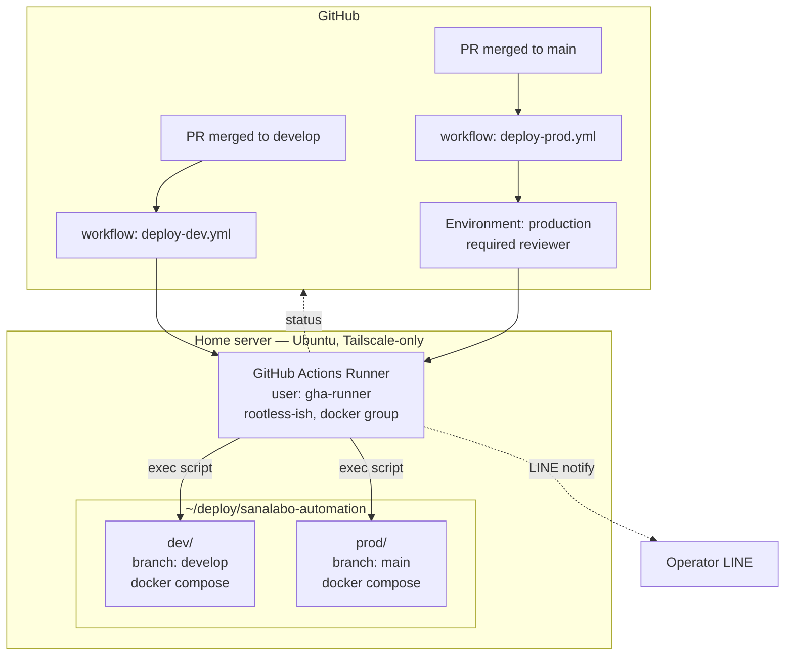

# Phase 4 — CI/CD Design (GitHub Actions Self-hosted Runner)

**Status:** Proposal — pending review
**Target environment:** On-premise home server (Ubuntu, Tailscale-only, `ssh timothy-dev-ts`)
**Supersedes:** The prior `deployment/production.md` guide, which described a Hetzner/cloud + `appleboy/ssh-action` deploy model. That topology is no longer in scope; the home-server runner pattern documented here is the sole supported path. Operational details live in [deployment/runner.md](../deployment/runner.md), [deployment/vault.md](../deployment/vault.md), and [deployment/docker.md](../deployment/docker.md).

---

## 1. Goals

1. **Zero-touch deploy**: `git push` to `develop` → dev auto-deploy; merge to `main` → prod deploy with approval gate.
2. **Fast rollback**: revert to any previous deployed revision in ≤ 1 minute.
3. **Multi-service ready**: The first service (sanalabo-automation) must set a repeatable pattern — adding a new service repo should reuse the same runner and deploy script with minimal edits.
4. **Safe secrets**: no secrets in git, no secrets in workflow logs, server `.env` managed from GitHub Secrets.
5. **Observability**: deploy success/failure surfaced in LINE (operator notifications) and in the GitHub Actions UI.

## 2. Non-goals (explicitly out of scope)

- Kubernetes / K3s migration. Tracked in the [homelab roadmap](../../.claude/MEMORY.md) — planned once service count passes ~3–5.
- Jenkins-based independent CI. Option C; revisit when the team grows beyond the current single maintainer.
- Blue/green or canary at the load-balancer level. Current topology is single-instance + Cloudflare Tunnel; rolling restart is the practical equivalent.
- Cross-server replication / HA.

## 3. Why self-hosted runner (recap)

The home server is reachable **only via Tailscale**. A GitHub-hosted runner cannot SSH into it without either:
- installing Tailscale in the runner each job (slow, brittle, token leaks in logs), or
- exposing SSH publicly (undesirable).

A self-hosted runner on the server itself eliminates the network problem and removes the SSH-from-cloud attack surface entirely.

## 4. Architecture overview



### Deployment flow per push

```
[Push event]
  → [Runner picks job]
  → [checkout repo at target SHA into ~/deploy/<env>]
  → [inject .env from GitHub Secrets → ~/deploy/<env>/.env]
  → [docker compose build (tagged with SHA)]
  → [docker compose up -d (rolling)]
  → [healthcheck: curl -f http://localhost:3000/health, 3 retries]
  → [pass] : tag current as "last-good-<env>", notify success
  → [fail] : rollback to previous "last-good-<env>", notify failure
```

## 5. Components

### 5.1 Self-hosted runner installation

**Location:** `/opt/actions-runner/` owned by a dedicated system user.

**Dedicated user rationale:** Isolate runner from `timothy01` (personal account) so a compromised workflow cannot read personal SSH keys, shell history, or user-level dotfiles.

```
user:    gha-runner       (system user, no login shell OR restricted shell)
groups:  gha-runner, docker
home:    /opt/actions-runner
```

**Why `docker` group?** The runner must invoke `docker compose` against the system daemon. The alternative — rootless Docker in the runner — is cleaner isolation but doubles complexity (separate daemon, separate networks, cloudflared sharing becomes awkward). We accept the shared-daemon compromise and mitigate via job-scoped directories and secret hygiene. Re-evaluate if we migrate to K3s (which changes the runtime model anyway).

**Registration scope:** Organization-level runner with a **label** (`home-server`). Future service repos in the same org pick it up by the `runs-on: [self-hosted, home-server]` label. Repo-level runner is too narrow for the multi-service goal.

**Auto-start:** systemd service (`actions.runner.<org>.<name>.service`, auto-generated by `./svc.sh install`).

### 5.2 Directory layout on server

```
/opt/actions-runner/                 # runner binary + config, owned by gha-runner
~gha-runner/deploy/
  _shared/
    cloudflared/                     # single tunnel container, shared by all services + envs
      docker-compose.yml
      config.yml                     # ingress rules: hostname → service:port
  sanalabo-automation/
    dev/                             # separate clone, branch: develop
      .env                           # populated by workflow from GitHub Secrets
      docker-compose.yml             # assistant only; joins shared cf_tunnel network
    prod/                            # separate clone, branch: main
      .env
      docker-compose.yml
  <next-service>/                    # future: same pattern
    dev/
    prod/
```

Deploy directories live exclusively under `gha-runner`'s home. The existing `~timothy01/deploy/` layout is migrated into `~gha-runner/deploy/` and removed during PR 2 so that ownership, permissions, and the manual-vs-automated deploy story stay consistent. The `_shared/` subtree holds infrastructure that cross-cuts services (currently only cloudflared — see §7.1).

### 5.3 Secret management

> **Status note (2026-04):** This section describes the **intermediate** GitHub-native approach used during PR 3. The long-term design moves to self-hosted HashiCorp Vault — see [phase4-vault.md](./phase4-vault.md) for the architecture, migration plan, and rationale. The section below is preserved for history and for the "emergency fallback to GitHub Secrets" path documented in `phase4-vault.md` §9.

**GitHub Secrets** (per-environment), intermediate design:

| Secret | Scope | Used for |
|--------|-------|----------|
| `DEV_ENV_FILE` | environment: `dev` | Full `.env` contents for dev |
| `PROD_ENV_FILE` | environment: `prod` | Full `.env` contents for prod |
| `LINE_NOTIFY_CHANNEL_TOKEN` | repository | Operator notifications |
| `OPERATOR_LINE_USER_ID` | repository | Notification target |

Workflow writes `DEV_ENV_FILE` contents to `~/deploy/sanalabo-automation/dev/.env` with `chmod 600` immediately before `docker compose up`. The file is never echoed to logs (`::add-mask::` on each line during render, or write via stdin redirection).

**Rotation:** updating the secret in GitHub and re-running the latest successful workflow re-populates `.env`. No server login needed for credential rotation — important UX win.

**Why replaced:** three limitations motivated the Vault transition: (1) management is confined to the GitHub Web UI — no Git history, no diff, no automation; (2) a monolithic `*_ENV_FILE` blob means single-variable rotation requires re-entering the full file; (3) adding services/envs scales the UI workload linearly. See `phase4-vault.md` §3.

### 5.4 Workflow files

Three files under `.github/workflows/`:

| File | Trigger | Env |
|------|---------|-----|
| `check-source-branch.yml` | PR → main | (existing, unchanged) |
| `deploy-dev.yml` | push → develop | environment: `dev` |
| `deploy-prod.yml` | push → main | environment: `prod` (with required reviewer) |

**`deploy-dev.yml` skeleton:**

```yaml
name: Deploy to dev
on:
  push:
    branches: [develop]
concurrency:
  group: deploy-dev
  cancel-in-progress: false   # finish current before next starts
jobs:
  deploy:
    runs-on: [self-hosted, home-server]
    environment: dev
    steps:
      - name: Checkout into deploy dir
        run: |
          cd ~/deploy/sanalabo-automation/dev
          git fetch origin develop
          git reset --hard origin/develop
      - name: Render .env
        run: |
          umask 077
          printf '%s' '${{ secrets.DEV_ENV_FILE }}' > ~/deploy/sanalabo-automation/dev/.env
      - name: Record previous image digest (for rollback)
        id: prev
        run: |
          cd ~/deploy/sanalabo-automation/dev
          echo "digest=$(docker compose images -q assistant | head -1)" >> $GITHUB_OUTPUT
      - name: Build & up
        run: |
          cd ~/deploy/sanalabo-automation/dev
          docker compose build --pull
          docker compose up -d
      - name: Healthcheck
        run: |
          for i in 1 2 3 4 5 6; do
            if docker exec dev-assistant-1 bun -e "fetch('http://localhost:3000/health').then(r=>{if(!r.ok)process.exit(1)})"; then
              exit 0
            fi
            sleep 10
          done
          exit 1
      - name: Rollback on failure
        if: failure() && steps.prev.outputs.digest != ''
        run: |
          cd ~/deploy/sanalabo-automation/dev
          docker tag ${{ steps.prev.outputs.digest }} dev-assistant:rollback
          docker compose up -d   # compose recreates from tagged image
      - name: Notify LINE
        if: always()
        run: |
          # call LINE push API with status, commit, job URL
          ...
```

`deploy-prod.yml` is structurally identical with `environment: prod` (which in GitHub Settings has `required_reviewers: [timothy-20]`). The reviewer approval gate is **free for public repos and for org members** — no paid plan needed for single-reviewer gating.

### 5.5 Rollback strategy

Two layers:

1. **Automatic (in-workflow):** recorded "previous image digest" before build. On healthcheck failure, retag and `compose up` reverts. Time to recovery: ~15 s.
2. **Manual (operator-initiated):** `workflow_dispatch` with input `revision: <sha>`. Re-runs the same deploy workflow but checks out that SHA. Useful when a deployed bug is discovered later.

Image retention: `docker image prune --force --filter "until=168h"` (keep 7 days) runs at the end of each successful deploy. Tagged rollback images are protected by tag.

### 5.6 Notifications

Reuse the existing LINE skill: a small script (`scripts/notify-deploy.ts`) called from the workflow posts to the operator's user ID.

| State | Message |
|-------|---------|
| Started | `▶️ Deploying <env> @ <short-sha>` |
| Success | `✅ Deploy <env> @ <short-sha> healthy (<elapsed>s)` |
| Failure | `❌ Deploy <env> @ <short-sha> failed at <step>. Rolled back.` + job URL |

Production extras: include PR number and title for traceability.

## 6. Security considerations

| Concern | Mitigation |
|---------|------------|
| Workflow with malicious code running on home server | Runner user isolated from `timothy01`; only `docker` group + deploy dirs writable. No `sudo` rights |
| Secret leak in logs | `::add-mask::` on `.env` contents; `secrets.*` never `echo`ed |
| Compromised GitHub token | PAT not used — runner uses OAuth app token per GitHub runner protocol. Rotate runner token if suspected |
| Public fork PR triggering workflow | `pull_request` triggers are **not** used for deploy workflows. Only `push` to protected branches + manual `workflow_dispatch` |
| Public repo × self-hosted runner (fork PR abuse of runner group) | Four-layer defense: (1) deploy workflows use `on: push` only, (2) `main`/`develop` branch protection gates push, (3) org runner group `Allow public repositories` is an explicit opt-in we acknowledge, (4) repo `Require approval for all external contributors` re-checks org membership per run. See [runner.md §6.2](../deployment/runner.md#62-allow-self-hosted-runners-on-public-repositories) and §6.4 |
| Runner machine compromised → cross-service blast radius | Accepted for single-server homelab. Mitigated when K3s migration provides namespace isolation |
| `.env` readable by other users on box | `chmod 600`, placed only in runner-user home |

## 7. Multi-service extension

When a second service repo is added:

1. No runner re-install: `runs-on: [self-hosted, home-server]` picks up the same runner.
2. Create `~gha-runner/deploy/<new-service>/{dev,prod}/` with its own `docker-compose.yml`.
3. Copy `deploy-dev.yml` / `deploy-prod.yml` verbatim, adjust paths and the container name used in healthcheck.
4. Add `<NEW>_ENV_FILE` secrets per environment.

No shared-state coupling between services; the runner is simply a job executor.

### 7.1 Shared cloudflared tunnel

Every service and environment shares a **single cloudflared container** under `~gha-runner/deploy/_shared/cloudflared/`. Cloudflare Tunnel supports multi-hostname routing in `config.yml`, so adding services or environments does not add cloudflared instances. This avoids the `N services × 2 envs = 2N tunnels` fan-out that would otherwise be unavoidable with per-service tunnels.

**Why this matters:**

- New service = one line in `config.yml`, no new container
- `docker compose up -d` on an app does **not** restart cloudflared → no LINE webhook gap during app deploys (addresses §9 decision 4)
- LINE channels register stable, per-env hostnames (`prod-line.<domain>`, `dev-line.<domain>`) that never change across redeploys

**Docker network:** a single external network `cf_tunnel` is created once; cloudflared and every service compose file attach to it.

```bash
docker network create cf_tunnel
```

**`_shared/cloudflared/config.yml`** (the routing table):

```yaml
tunnel: <tunnel-id>
credentials-file: /etc/cloudflared/creds.json
ingress:
  - hostname: dev-line.<your-domain>
    service: http://sanalabo-dev-assistant:3000
  - hostname: prod-line.<your-domain>
    service: http://sanalabo-prod-assistant:3000
  # future services append here
  - hostname: <next-dev>.<your-domain>
    service: http://<container-name>:<port>
  - service: http_status:404      # catch-all
```

**`_shared/cloudflared/docker-compose.yml`** (sketch):

```yaml
services:
  cloudflared:
    image: cloudflare/cloudflared:latest
    restart: unless-stopped
    command: tunnel --config /etc/cloudflared/config.yml run
    volumes:
      - ./config.yml:/etc/cloudflared/config.yml:ro
      - ./creds.json:/etc/cloudflared/creds.json:ro
    networks: [cf_tunnel]
networks:
  cf_tunnel:
    external: true
```

**Per-service compose (both dev and prod)** attaches the app to the shared network with a deterministic container name so the tunnel can address it:

```yaml
services:
  assistant:
    container_name: sanalabo-<env>-assistant    # referenced by config.yml ingress
    networks: [cf_tunnel, default]
    ...
networks:
  cf_tunnel:
    external: true
```

**Adding a service:**

1. Choose hostname, register DNS (Cloudflare dashboard or `cloudflared tunnel route dns`)
2. Append an ingress entry to `_shared/cloudflared/config.yml`
3. `docker compose up -d` inside `_shared/cloudflared/` to reload routing (no tunnel downtime for existing hostnames)
4. Deploy the new service; its compose file joins `cf_tunnel`

**Implemented in PR 4a** (shared cloudflared structure + main compose migration). Hostname routing is registered by operators via `cloudflared tunnel route dns <name> <hostname>`; DNS records are created as proxied CNAMEs to the tunnel UUID.

## 8. Migration plan (implementation order)

Split into small PRs. Each ends in a verifiable state.

| PR | Content | Verification |
|----|---------|--------------|
| 1 | **This design doc** | Review + approve |
| 2 | Register runner on server (manual steps) + add `runner.md` install guide under `docs/deployment/` | `gh api /repos/.../actions/runners` shows online |
| 3 | `deploy-dev.yml` (no notifications yet) + secrets `DEV_ENV_FILE` | push to develop triggers deploy; dev container restarts with new SHA |
| 4 | `deploy-prod.yml` + `prod` environment approval gate + `PROD_ENV_FILE` | merge to main requires approval; prod deploys after approve |
| 5 | `scripts/notify-deploy.ts` + wire into both workflows | LINE message arrives on next deploy |
| 6 | `workflow_dispatch` manual rollback input + document the procedure | manual rollback to a prior SHA succeeds |

Total estimated wall-time: **~1 working session per PR**, sequential because each depends on the previous.

**Vault migration track** (parallel to above, starts after PR 3 reaches dev-deploy stability): the PR sequence documented in [phase4-vault.md §9](./phase4-vault.md#9-migration-plan) replaces the `*_ENV_FILE` secrets with Vault-backed per-variable fetches via `hashicorp/vault-action`. PRs 4–6 of this doc land on top of that foundation (i.e., `deploy-prod.yml` is written against Vault, not against `PROD_ENV_FILE`).

## 9. Decisions

All questions raised during design review are resolved as follows. Implementation PRs (2–6) inherit these as fixed constraints.

1. **Deploy directory ownership** — migrate to `~gha-runner/deploy/` and remove `~timothy01/deploy/`. Clean single-ownership story outweighs the transient disruption to manual-deploy habits. Migration is part of PR 2.
2. **Runner token rotation** — quarterly. PR 2 adds a rotation runbook to `docs/deployment/runner.md` and a calendar reminder convention. Cost is ~5 min per quarter; benefit is muscle memory for the "token suspected compromised" path.
3. **Dev approval gate** — none. `develop` merge auto-deploys to dev immediately. Branch ruleset + PR review already gate *what* reaches develop; adding a second click would blunt dev's purpose as the "catch issues fast" environment. Prod keeps the required-reviewer gate (see §11.1 for the removal criteria once the project matures).
4. **Cloudflared topology** — shared tunnel architecture (§7.1). One cloudflared container under `_shared/` serves every service and environment via multi-hostname ingress. This both dissolves the "tunnel restarts when app restarts" problem and prevents `N × 2` fan-out as more services are added. Landed in PR 4a; mode is **locally managed** (`credentials-file` + `config.yml` committed to the repo) — the earlier remotely-managed token approach (PR #37) is superseded.
5. **Image retention** — 7 days. `docker image prune --force --filter "until=168h"` at the end of each successful deploy. Rolling back beyond 7 days means `git checkout <sha> && docker build`, which is acceptable for the rare case.
6. **Secret management target state** — self-hosted HashiCorp Vault, not GitHub Environment Secrets. The intermediate `*_ENV_FILE` approach (§5.3) exists only because PR 3 needed a working dev deploy before Vault infrastructure could be stood up; the Vault track in `phase4-vault.md` supersedes it. Rationale: management as code (HCL policies in Git), per-variable secrets with version history (KV v2), and linear scaling to multi-service/multi-env (same JWT role pattern).

---

## 10. Risks and mitigations

| Risk | Impact | Mitigation |
|------|--------|------------|
| Runner crashes or hangs | Deploys fail until restart | systemd auto-restart; monitoring via GitHub runner status API (manual check initially, add automation in later phase) |
| `.env` rendering fails mid-deploy | App starts with stale config | Render `.env` into a temp file first, atomic `mv` |
| Healthcheck false positive (passes but app broken) | Bad deploy stays live | Out of scope for Phase 4. Addressed later by functional smoke tests in the workflow |
| Self-hosted runner reachable from developer shells | Anyone with home-server login could read runner state | Runner home is mode 750, owned by `gha-runner`. `timothy01` is not in `gha-runner` group |
| Power outage during deploy | Partial state | `docker compose up -d` is idempotent. Next successful run converges |

## 11. Future evolution

Decisions that are deliberately deferred. The current design chooses the safer default while documenting the path to the lighter alternative once supporting infrastructure catches up. These are not TODOs for Phase 4 — they are signposts for later phases.

### 11.1 Removing the prod approval gate (Continuous Delivery → Continuous Deployment)

Prod currently requires a reviewer click per deploy (§5.4). This trades friction for an explicit "deploy now" moment. Industry-elite organizations (per DORA's *State of DevOps Report*) run Continuous Deployment — `main` merge ships to prod with no human in the loop — but only because their safety net is dense enough to absorb the risk.

Remove the gate once **all** of the following are in place:

- [ ] Integration smoke tests in CI that exercise the live LINE webhook path end-to-end, not only `/health`
- [ ] Metrics + alerting pipeline (request latency, deploy success rate, error rate) with a notification path for failures
- [ ] Time-window policy — block deploys outside working hours or auto-defer them, so an early-morning merge does not ship unattended
- [ ] Change-failure rate below 15% measured over ≥30 deploys (DORA "High performers" threshold)

At that point the PR itself becomes the single approval; a second click adds no signal.

### 11.2 Canary / blue-green rollouts

Single-instance topology precludes true canary. Revisit alongside the K3s migration on the homelab roadmap — Kubernetes `Deployment` + `Service` abstractions make percentage rollouts straightforward and remove the single-container restart window entirely.

### 11.3 Feature flags

Decoupling code deploy from feature enablement is the standard practice for high-velocity teams (LaunchDarkly, Unleash, in-house systems at Facebook / GitHub). Not scoped for Phase 4 — revisit once the service has distinct user segments, A/B needs, or tenant-specific rollouts.

## 12. References

- [GitHub Actions — self-hosted runners](https://docs.github.com/en/actions/hosting-your-own-runners/managing-self-hosted-runners/about-self-hosted-runners)
- [GitHub Actions — using environments](https://docs.github.com/en/actions/deployment/targeting-different-environments/using-environments-for-deployment)
- [GitHub Actions — required reviewers](https://docs.github.com/en/actions/deployment/targeting-different-environments/using-environments-for-deployment#required-reviewers)
- In-repo operational docs: [deployment/runner.md](../deployment/runner.md) (runner install/rotation), [deployment/vault.md](../deployment/vault.md) (secret backend), [deployment/docker.md](../deployment/docker.md) (Docker Compose + shared tunnel)
