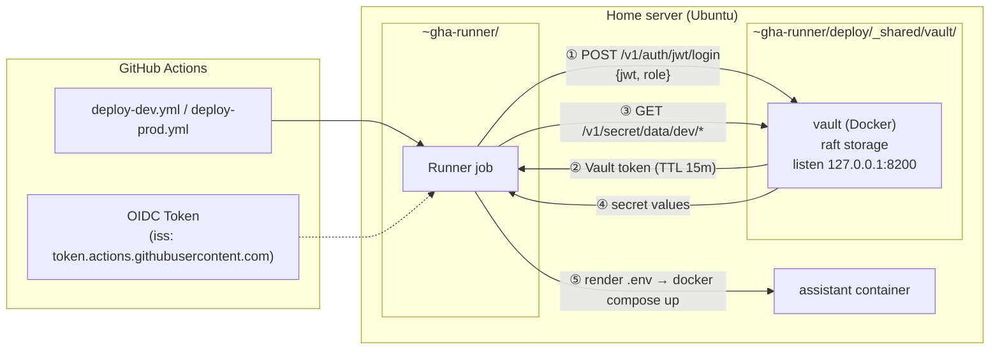

# Phase 4 — Vault 기반 Secret 관리 설계

**Status:** Proposal — pending review
**Depends on:** [phase4-cicd.md](./phase4-cicd.md) (self-hosted runner 구성)
**Supersedes:** phase4-cicd.md §5.3 "GitHub Secrets 기반 `.env` 렌더" 섹션 — Vault 도입 이후 해당 섹션은 "중간 단계"로 이력 보존

---

## 1. Goals

1. **Secret 관리의 단일 출처(SSOT)**: `.env` 파일 또는 GitHub Environment Secrets에 흩어진 값을 Vault 한 곳으로 수렴
2. **코드로 관리 가능한 정책**: 어떤 워크플로가 어떤 키를 읽는지 정책 파일(HCL)로 레포에 체크인
3. **GitHub 외부 공격면 최소화**: GitHub 계정이나 Actions token이 유출되어도 long-lived secret이 직접 노출되지 않음(OIDC 단기 토큰 기반 인증)
4. **다중 서비스 확장**: 서비스 추가 시 KV 경로만 늘리고 동일한 JWT auth/policy 패턴 재사용
5. **운영 부담 상한**: 홈서버 단일 인스턴스로 동작, manual unseal 허용. auto-unseal은 나중으로
6. **앱 암호화 키 중앙화**: 앱이 쓰는 `TOKEN_ENCRYPTION_KEY`(OAuth refresh_token AES-256-GCM 암호화용 static key)를 Vault Transit engine으로 대체. 키 머티리얼 자체를 `.env`로 배포하는 경로 제거

## 2. Non-goals

- Vault HA 클러스터 (raft storage는 사용하되 단일 노드 운영. 멀티 노드는 K3s 마이그레이션 시 재검토)
- Dynamic secrets (DB 자격증명 등을 Vault가 on-demand로 발급하는 기능). 현재 앱은 long-lived API key만 사용하므로 불필요
- Vault Enterprise 기능 (Namespaces, DR replication, Control Groups 등)

## 3. 왜 Vault인가 — 현 방식의 한계

phase4-cicd.md §5.3의 GitHub Environment Secrets 방식은 세 가지 한계를 가진다:

| 한계 | 구체 증상 |
|------|----------|
| 관리 포인트 분산 | 값 추가/회전 시 GitHub Web UI에서만 편집. 자동화·감사·diff 불가 |
| 레코드로 재현 불가 | "지금 dev에 어떤 secret이 등록되어 있는가?"를 Git 이력으로 답할 수 없음 |
| 확장성 | 서비스 N개 × 환경 2개 × secret M개 → Web UI 수작업이 O(N·M)로 선형 증가 |

Vault는 HCL 정책과 KV 경로 규약을 Git에 체크인하면서도 **값 자체는 Vault 인스턴스에만 두고**, 워크플로는 GitHub OIDC로 단기 인증해 fetch한다. 값은 한 곳에 있고 policy/경로는 코드로 관리된다.

## 4. 대안 비교

| 옵션 | 장점 | 단점 | 결론 |
|------|------|------|------|
| GitHub Environment Secrets 유지 | 별도 인프라 불필요 | §3 한계 그대로 | 기각 — 장기 확장 막힘 |
| Infisical (SaaS 또는 self-host) | UI 친화적, GitHub Action 공식 지원 | self-host 시에도 PostgreSQL 의존, 학습 자료 Vault 대비 적음 | 보류 — 단순한 환경에는 과하지 않으나 사용자가 Vault를 선호 |
| Doppler (SaaS) | 설정 간단 | SaaS 종속, 비용 지속 발생, self-host 불가 | 기각 — 홈랩 철학과 불일치 |
| AWS Secrets Manager / GCP Secret Manager | 관리형, OIDC 연동 공식 지원 | 클라우드 비용, 홈서버-only 환경에서 네트워크 의존 증가 | 기각 — 홈서버에 로컬에 두는 게 지연·비용 모두 우위 |
| **HashiCorp Vault (self-host)** | 업계 표준, HCL 정책으로 IaC 친화, JWT auth로 GitHub OIDC 직결 | 초기 구성·unseal 운영 학습 필요 | **채택** |

**운영 부담 비교 (Infisical vs Vault)**: 두 제품 모두 단일 노드 Docker 기반으로 운영 가능. 차이점은 (1) Vault는 `raft` 내장 storage로 PostgreSQL 같은 외부 DB 불필요, (2) Vault는 seal/unseal 개념으로 시작 시 1회 수작업이 있음(Infisical에는 없음). Phase 4 목적은 학습+장기 채택이므로 Vault의 초기 불편함을 감수.

## 5. 아키텍처 개요



**핵심**: Vault는 홈서버 `127.0.0.1:8200`에만 바인딩(외부 네트워크 미노출). GitHub Actions의 OIDC 토큰은 runner가 GitHub에서 수령한 뒤 로컬 Vault로 전달(HTTPS 미필요, localhost TCP). Vault가 토큰을 검증해 Vault token을 발급하고, 해당 토큰으로 정책이 허용하는 KV 경로만 읽을 수 있다.

## 6. 컴포넌트

### 6.1 Vault 배포

**위치**: `~gha-runner/deploy/_shared/vault/` (phase4-cicd.md §5.2 `_shared/` 계층과 일관)

**storage**: `raft` (단일 노드). 외부 DB 의존 없음. 데이터는 `./data/` bind-mount

**listener**: `tcp` on `127.0.0.1:8200`, `tls_disable = 1`. 외부 노출 없고 같은 호스트의 runner만 접근하므로 TLS 생략(운영 단순화). Tailscale 등으로 원격 admin 접근 시에는 추가 listener를 별도로 구성

**docker-compose.yml 스케치**:

```yaml
services:
  vault:
    image: hashicorp/vault:latest
    container_name: vault
    restart: unless-stopped
    cap_add: [IPC_LOCK]
    ports:
      - "127.0.0.1:8200:8200"
    volumes:
      - ./config/vault.hcl:/vault/config/vault.hcl:ro
      - ./data:/vault/data
      - ./audit:/vault/audit
    command: vault server -config=/vault/config/vault.hcl
```

**`config/vault.hcl`**:

```hcl
storage "raft" {
  path    = "/vault/data"
  node_id = "vault-home-01"
}

listener "tcp" {
  address     = "0.0.0.0:8200"   # 컨테이너 내부 주소. 호스트는 127.0.0.1에만 바인딩
  tls_disable = 1
}

api_addr     = "http://127.0.0.1:8200"
cluster_addr = "http://127.0.0.1:8201"
ui           = true
```

**초기화 플로우** (1회):
1. `docker compose up -d vault`
2. `docker exec -it vault vault operator init -key-shares=1 -key-threshold=1` → unseal key, root token 출력
3. Unseal key와 root token은 **홈서버 외부의 오프라인 저장소**(비밀번호 관리자)에 보관. 레포·runner 홈에 두지 않음
4. `vault operator unseal <key>`로 언실
5. 이후 §6.2의 auth 구성, §6.3의 policy, §6.4의 secret 적재는 root token으로 한 번 수행

### 6.2 Auth method — JWT / GitHub OIDC

GitHub Actions는 모든 워크플로 job에 대해 OIDC ID token을 발급한다(`token.actions.githubusercontent.com` 발행, claim에 repo/ref/environment 포함). Vault의 `jwt` auth method가 이 토큰을 검증해 Vault token을 발급한다.

**구성**:

```bash
vault auth enable jwt

vault write auth/jwt/config \
  bound_issuer="https://token.actions.githubusercontent.com" \
  oidc_discovery_url="https://token.actions.githubusercontent.com"

vault write auth/jwt/role/gha-dev \
  role_type="jwt" \
  user_claim="sub" \
  bound_claims_type="glob" \
  bound_claims='{"repository":"Sana-Labo/sanalabo-automation","environment":"dev"}' \
  bound_audiences="https://vault.home.local" \
  token_policies="read-dev" \
  token_ttl="15m" \
  token_max_ttl="15m"

vault write auth/jwt/role/gha-prod \
  role_type="jwt" \
  user_claim="sub" \
  bound_claims_type="glob" \
  bound_claims='{"repository":"Sana-Labo/sanalabo-automation","environment":"prod"}' \
  bound_audiences="https://vault.home.local" \
  token_policies="read-prod" \
  token_ttl="15m" \
  token_max_ttl="15m"
```

**`bound_claims`의 의미**:
- `repository`: 다른 레포 워크플로가 우리 dev/prod secret에 도달할 수 없음
- `environment`: GitHub Environment 선언(`environment: dev`)이 없으면 role 매칭 실패. phase4-cicd.md의 approval gate(prod 리뷰어)도 함께 작동함

`bound_audiences`의 값(`https://vault.home.local`)은 실존 호스트일 필요가 없다. 워크플로가 OIDC 토큰을 요청할 때 지정하는 문자열로, role 구성과 1:1 매칭되어 토큰 재사용을 방지한다.

### 6.3 Policy 설계

`policies/` 디렉터리에 HCL 파일로 체크인(Vault 인스턴스 외부에 버전 관리).

**`policies/read-dev.hcl`**:

```hcl
path "secret/data/dev/*" {
  capabilities = ["read"]
}

path "secret/metadata/dev/*" {
  capabilities = ["list"]
}
```

**`policies/read-prod.hcl`**: 위와 동일, `dev` → `prod`

**적재**:

```bash
vault policy write read-dev policies/read-dev.hcl
vault policy write read-prod policies/read-prod.hcl
```

Dev role은 prod secret을 읽을 수 없고 역도 마찬가지다. 경로 단위로 격리가 시행된다.

### 6.4 Secret engine — KV v2 경로 규약

```bash
vault secrets enable -path=secret -version=2 kv
```

**경로 규약**: `secret/<env>/<KEY>` — 한 secret당 하나의 경로. 멀티라인 blob을 한 경로에 담지 않는다.

**초기 적재** (dev 예시):

```bash
vault kv put secret/dev/ANTHROPIC_API_KEY value="sk-ant-..."
vault kv put secret/dev/LINE_CHANNEL_ACCESS_TOKEN value="..."
vault kv put secret/dev/LINE_CHANNEL_SECRET value="..."
vault kv put secret/dev/SYSTEM_ADMIN_IDS value="Uxxxxx,Uyyyyy"
vault kv put secret/dev/GOOGLE_CLIENT_ID value="..."
vault kv put secret/dev/GOOGLE_CLIENT_SECRET value="..."
vault kv put secret/dev/GOOGLE_REDIRECT_URI value="..."
vault kv put secret/dev/TOKEN_ENCRYPTION_KEY value="..."
```

KV v2를 선택한 이유: 버전 관리 내장(회전 시 이전 버전 보존 → 사고 시 즉시 롤백 가능). 추가 운영 비용은 사실상 없다.

### 6.5 Transit engine — 앱 암호화 서비스

앱 런타임의 OAuth refresh token 암호화(현재 `TOKEN_ENCRYPTION_KEY` 기반 AES-256-GCM, `src/skills/gws/encryption.ts` 참조)를 Vault Transit engine의 encrypt/decrypt API로 대체한다. 키 머티리얼이 Vault 외부로 나오지 않는다 — 앱은 평문과 ciphertext만 주고받는다.

**활성화**:

```bash
vault secrets enable transit

vault write -f transit/keys/tokens \
  type=aes256-gcm96 \
  exportable=false \
  deletion_allowed=false
```

- `exportable=false`: 생성된 키 머티리얼은 Vault 밖으로 export 불가(유출 경로 봉쇄)
- `deletion_allowed=false`: 실수로 keys를 삭제해 기존 ciphertext를 영구 복호 불가로 만드는 사고 방지

**봉투 암호화(envelope encryption)**: Vault Transit은 내부적으로 2-tier 키 계층을 관리 — master keyring이 각 operation마다 생성되는 DEK(data encryption key)를 감싸고, ciphertext에는 DEK가 wrap된 형태로 포함된다. 앱 레벨에서는 이 계층을 의식할 필요 없음. 공개 API는 `encrypt`/`decrypt` 두 개만 노출된다.

**앱 전용 정책** (`policies/app-transit.hcl`):

```hcl
path "transit/encrypt/tokens" {
  capabilities = ["update"]
}

path "transit/decrypt/tokens" {
  capabilities = ["update"]
}
```

Transit의 encrypt/decrypt는 `update` capability로 호출한다(Vault convention — "write + response 포함"). `read`는 키 메타데이터 조회용이므로 앱에 부여하지 않는다.

**앱 ↔ Vault 인증**: 앱 컨테이너가 런타임에 Vault와 인증해야 한다. 구체적 방식(AppRole, vault-agent sidecar, 또는 다른 수단)은 PR 4-a 착수 시 결정. 본 PR 2는 Transit engine 활성화와 `tokens` key 생성, policy HCL 체크인까지만 다룬다.

**회전**: `vault write -f transit/keys/tokens/rotate`. 기존 ciphertext는 이전 key version으로 자동 복호(Vault가 version 번호를 ciphertext 메타데이터에 박아 둠). 회전 후 재암호화는 선택 — `vault write transit/rewrap/tokens ciphertext=...`로 새 버전으로 rewrap 가능하나, 이전 version이 아카이브에 남아 있는 한 정합성은 유지된다.

### 6.6 Workflow 통합

`hashicorp/vault-action@v3`는 JWT auth + KV v2 fetch를 한 스텝으로 처리한다. workflow 예시(`deploy-dev.yml`):

```yaml
permissions:
  contents: read
  id-token: write         # OIDC 토큰 요청에 필요

jobs:
  deploy:
    runs-on: [self-hosted, home-server]
    environment: dev       # jwt role의 bound_claims.environment와 일치해야 함
    steps:
      - name: Fetch secrets from Vault
        id: vault
        uses: hashicorp/vault-action@v3
        with:
          url: http://127.0.0.1:8200
          method: jwt
          role: gha-dev
          jwtGithubAudience: https://vault.home.local
          exportEnv: false                    # step outputs에만 노출, 프로세스 env로 확산 방지
          secrets: |
            secret/data/dev/ANTHROPIC_API_KEY value | ANTHROPIC_API_KEY ;
            secret/data/dev/LINE_CHANNEL_ACCESS_TOKEN value | LINE_CHANNEL_ACCESS_TOKEN ;
            secret/data/dev/LINE_CHANNEL_SECRET value | LINE_CHANNEL_SECRET ;
            secret/data/dev/SYSTEM_ADMIN_IDS value | SYSTEM_ADMIN_IDS ;
            secret/data/dev/GOOGLE_CLIENT_ID value | GOOGLE_CLIENT_ID ;
            secret/data/dev/GOOGLE_CLIENT_SECRET value | GOOGLE_CLIENT_SECRET ;
            secret/data/dev/GOOGLE_REDIRECT_URI value | GOOGLE_REDIRECT_URI ;
            secret/data/dev/TOKEN_ENCRYPTION_KEY value | TOKEN_ENCRYPTION_KEY ;

      - name: Render .env
        env:
          ANTHROPIC_API_KEY: ${{ steps.vault.outputs.ANTHROPIC_API_KEY }}
          LINE_CHANNEL_ACCESS_TOKEN: ${{ steps.vault.outputs.LINE_CHANNEL_ACCESS_TOKEN }}
          LINE_CHANNEL_SECRET: ${{ steps.vault.outputs.LINE_CHANNEL_SECRET }}
          SYSTEM_ADMIN_IDS: ${{ steps.vault.outputs.SYSTEM_ADMIN_IDS }}
          GOOGLE_CLIENT_ID: ${{ steps.vault.outputs.GOOGLE_CLIENT_ID }}
          GOOGLE_CLIENT_SECRET: ${{ steps.vault.outputs.GOOGLE_CLIENT_SECRET }}
          GOOGLE_REDIRECT_URI: ${{ steps.vault.outputs.GOOGLE_REDIRECT_URI }}
          TOKEN_ENCRYPTION_KEY: ${{ steps.vault.outputs.TOKEN_ENCRYPTION_KEY }}
        run: |
          umask 077
          {
            printf 'ANTHROPIC_API_KEY=%s\n' "$ANTHROPIC_API_KEY"
            printf 'LINE_CHANNEL_ACCESS_TOKEN=%s\n' "$LINE_CHANNEL_ACCESS_TOKEN"
            printf 'LINE_CHANNEL_SECRET=%s\n' "$LINE_CHANNEL_SECRET"
            printf 'SYSTEM_ADMIN_IDS=%s\n' "$SYSTEM_ADMIN_IDS"
            printf 'GOOGLE_CLIENT_ID=%s\n' "$GOOGLE_CLIENT_ID"
            printf 'GOOGLE_CLIENT_SECRET=%s\n' "$GOOGLE_CLIENT_SECRET"
            printf 'GOOGLE_REDIRECT_URI=%s\n' "$GOOGLE_REDIRECT_URI"
            printf 'TOKEN_ENCRYPTION_KEY=%s\n' "$TOKEN_ENCRYPTION_KEY"
            printf 'PORT=3000\n'
          } > "$DEPLOY_DIR/.env"
          chmod 600 "$DEPLOY_DIR/.env"
```

> **주의(전환 경로)**: 위 workflow는 PR 3 기준. PR 4-a 이후 앱이 Vault Transit을 런타임에 직접 호출하므로 `TOKEN_ENCRYPTION_KEY` 라인(fetch + render 양쪽)은 제거된다. `.env`에는 static 설정값만 남는다.

**보안 속성**:
- vault-action이 fetch한 값은 GitHub Actions가 자동으로 log mask
- Vault token은 job 범위 15분짜리 → 워크플로 끝나면 의미 없음(재사용 불가)
- `.env`는 `umask 077`로 즉시 0600 생성
- OIDC 토큰은 GitHub가 job별로 새로 발급 → 값의 재사용 가능성 없음

### 6.7 Unseal 전략

**초기(Phase 4)**: Manual unseal. Vault 컨테이너 기동 시 운영자 macOS 워크스테이션의 Apple Keychain에서 unseal key를 꺼내 홈서버로 전달해 1회 실행.

```bash
# 운영자 macOS에서
UNSEAL_KEY=$(security find-generic-password -a vault-admin -s home-vault-unseal-key -w)
ssh timothy-dev-ts "docker exec vault vault operator unseal $UNSEAL_KEY"
```

키 보관: `security add-generic-password -a vault-admin -s home-vault-unseal-key -w <key> -U` (상세 절차는 [docs/deployment/vault.md](../deployment/vault.md)). 유실 내성은 동일 Apple ID에 로그인된 다른 Apple 디바이스 iCloud Keychain 동기화로 확보.

동반 효과: 재부팅 후 배포가 즉시 실패하므로 "배포 실패 → SSH → unseal → 재배포"라는 명시적 복구 절차가 강제된다. 자동화보다 학습에 유리.

**장기**: Auto-unseal 후보 두 가지 — 둘 다 Phase 4 범위 밖.
1. **Transit seal** — 별도의 Vault 인스턴스를 Transit engine 전용으로 돌리고 메인 Vault가 이를 통해 auto-unseal. 단일 홈서버에서는 이중화 의미 약함
2. **Cloud KMS** (AWS KMS / GCP KMS) — 클라우드 의존 발생, 홈랩 철학과 트레이드오프

### 6.8 백업

**메커니즘**: Vault raft storage의 `snapshot` 명령.

```bash
vault operator raft snapshot save /backup/vault-$(date +%Y%m%d).snap
```

**스케줄**: cron으로 일 1회. 보관은 7일. 스냅샷 파일은 암호화되어 있으므로 unseal key 없이는 복호화 불가.

**복원 리허설**: Phase 4 단계에서는 최소 1회 수행(설계 PR의 후속 PR에 포함). 검증 없이는 백업이 아님.

## 7. 운영

### 7.1 회전

1. 새 값으로 `vault kv put secret/dev/<KEY> value="<new>"` (KV v2가 이전 버전 자동 보존)
2. 워크플로 재실행(develop에 빈 커밋 push 또는 Actions UI에서 re-run)
3. `.env`가 새 값으로 재렌더 → 컨테이너 재기동

회전 시 GitHub Web UI 진입 없음. 값의 이력은 `vault kv metadata get secret/dev/<KEY>`로 조회.

### 7.2 감사(audit)

`audit/` 디렉터리에 파일 audit device 활성화:

```bash
vault audit enable file file_path=/vault/audit/vault.log
```

GitHub Actions의 모든 secret read는 `vault.log`에 JSON으로 기록된다. 유출 사고 조사 시 사용.

## 8. Security considerations

| 우려 | 완화 |
|------|------|
| Vault unseal key 유출 | 운영자 macOS의 Apple Keychain에만 보관. 홈서버(runner 홈 포함) 파일시스템에는 평문/암호화 어떤 형태로도 두지 않음. Keychain 접근은 macOS 로그인 세션으로 게이트 |
| Vault root token 상시 사용 | 초기 구성 후 root token revoke. 이후 조작은 admin policy의 별도 token으로 |
| OIDC subject claim 스푸핑 | `bound_claims.repository` + `bound_claims.environment`로 정확히 우리 레포의 특정 환경 job만 허용 |
| vault-action fetch 로그 노출 | GitHub Actions mask + `exportEnv: false` (step outputs 범위로 한정) |
| Vault 컨테이너 크래시 → 배포 블록 | 의도된 동작. unseal + 재시작 runbook 문서화 |
| Compromised runner가 Vault 조회 | 해당 job 범위의 policy로 한정된 경로만 읽힘. dev runner가 prod secret 접근 불가 |
| 백업 파일 유출 | 백업은 암호화된 raft snapshot. Unseal key 없이는 복호 불가 |

## 9. Migration plan

| PR | 내용 | 검증 |
|----|------|------|
| 1 | **이 설계 문서** (phase4-vault.md 추가 + phase4-cicd.md §5.3 주석 갱신) | 리뷰 승인 |
| 2 | `~gha-runner/deploy/_shared/vault/` compose + config + policies 디렉터리 추가 + 운영 runbook(`docs/deployment/vault.md`) | 홈서버에서 `vault status`가 unsealed 응답 |
| 3 | Vault에 dev secret 8개 적재 + jwt role `gha-dev` 구성 + `deploy-dev.yml` 재작성(vault-action 기반) | develop push → 배포 성공, `.env`가 Vault 값으로 렌더됨 |
| 4 | prod secret 적재 + `gha-prod` role + `deploy-prod.yml` 재작성 + approval gate | main merge → 승인 후 prod 배포 성공 |
| 4-a | 앱 코드에 `VaultTransitEncryption` 구현(기존 `AesGcmEncryption`과 동일 `EncryptionService` 인터페이스) + 앱 ↔ Vault 인증 구성(AppRole 또는 vault-agent) + `.env`에서 `TOKEN_ENCRYPTION_KEY` 제거 | 새로 발급되는 refresh token이 Transit으로 암호화되어 저장됨. 기존 AES-encrypted 토큰은 이 PR 범위에서 그대로 유지(다음 PR에서 마이그레이션) |
| 4-b | 기존 `data/workspaces/*/tokens.enc`를 AES 복호 → Transit 재암호화하는 one-off 스크립트 실행 후 AES 경로 제거 | 모든 저장 토큰이 Transit 포맷으로 일원화, `TOKEN_ENCRYPTION_KEY` 의존 소거 |
| 5 | Audit device 활성화 + snapshot cron + 복원 리허설 보고서 | 백업 파일 존재 + 복원 성공 로그 |

**PR #53(개별 secret 리팩터) 처리**: draft 유지 → PR 3 머지 시점에 close. 해당 PR의 workflow 변경은 PR 3의 vault-action 기반 재작성에 포함되므로 독립 머지 가치 없음.

**롤백 경로**: Vault 장애 시 GitHub Environment Secrets로 임시 복귀할 수 있도록, 개별 secret 값 백업(Vault에 있는 값과 동일)을 비밀번호 관리자에 병행 보관. 긴급 시 한 개 PR로 workflow를 GitHub Secrets fetch로 재전환 가능.

## 10. Risks and mitigations

| 위험 | 영향 | 완화 |
|------|------|------|
| 재부팅 후 unseal 누락 → 배포 블록 | dev/prod 모두 정지 | systemd override로 `docker compose up` 자동 시작. Unseal은 사용자가 SSH로 1회. 운영자 알림은 배포 실패 LINE 통지가 담당(phase4-cicd.md §5.6) |
| Vault 버그로 데이터 손상 | 모든 secret 상실 | 일 1회 snapshot + 외부 백업 저장 |
| GitHub OIDC 발행자/형식 변경 | 모든 워크플로 인증 실패 | vault-action이 공식적으로 추종. `oidc_discovery_url` 기반이므로 Vault 측 재구성으로 대응 |
| 운영자(나) 1인 체계에서 unseal key 유실 | 영구 복구 불가 | `-key-shares=1 -key-threshold=1`로 초기화(분산 보관소 확보 비현실). 유실 내성은 Apple Keychain iCloud 동기화로 다중 Apple 디바이스 간 복제로 확보. 최악(Apple ID 완전 상실) 시 API key 전량 재발급 + Vault 재초기화(예상 30분~1시간) |
| Vault 인스턴스 과한 운영 부담 | 학습 시간 소모 | 단일 노드 + raft로 최소 구성. auto-unseal/HA는 의도적으로 후순위 |

## 11. Decisions needed

설계 리뷰에서 확정할 항목.

1. **Unseal key shares** (결정 완료) — `-key-shares=1 -key-threshold=1`. 3 shares 분산 보관소 확보 불가(1인 운영, 물리 보관소 3곳 비현실적). 단일 키 유실 내성은 Apple Keychain iCloud 동기화로 다중 디바이스 복원 경로 확보
2. **Vault Web UI 접근 경로** — listener를 `127.0.0.1`에만 두면 UI 접근은 (a) SSH 포트 포워딩, (b) Tailscale 전용 추가 listener 중 하나. 운영 동선에 따라 선택
3. **Snapshot 저장 위치** — 홈서버 로컬만(장애 시 함께 소실) vs Cloudflare R2 등 외부 동기화. 백업 철학 결정
4. **Audit log 보존 기간** — 30일/90일/무제한. 디스크 사용량과 사고 조사 요구를 저울질
5. **`TOKEN_ENCRYPTION_KEY`의 Vault 관리** (결정 완료) — Vault Transit engine으로 이관(§1 Goal #6, §6.5). `.env` 렌더 경로 제거. 전환 PR은 §9 Migration plan의 PR 4-a(앱 코드 전환), PR 4-b(기존 ciphertext 재암호화 마이그레이션)로 분할

## 12. References

- [HashiCorp Vault — JWT/OIDC auth method](https://developer.hashicorp.com/vault/docs/auth/jwt)
- [HashiCorp Vault — KV v2 secrets engine](https://developer.hashicorp.com/vault/docs/secrets/kv/kv-v2)
- [HashiCorp Vault — raft integrated storage](https://developer.hashicorp.com/vault/docs/configuration/storage/raft)
- [hashicorp/vault-action](https://github.com/hashicorp/vault-action)
- [GitHub Docs — OIDC with HashiCorp Vault](https://docs.github.com/en/actions/deployment/security-hardening-your-deployments/configuring-openid-connect-in-hashicorp-vault)
- [GitHub Docs — About security hardening with OpenID Connect](https://docs.github.com/en/actions/deployment/security-hardening-your-deployments/about-security-hardening-with-openid-connect)
- 관련 레포 문서: [phase4-cicd.md](./phase4-cicd.md), [deployment/ci-secrets.md](../deployment/ci-secrets.md) (중간 단계, PR 3에서 대체)
