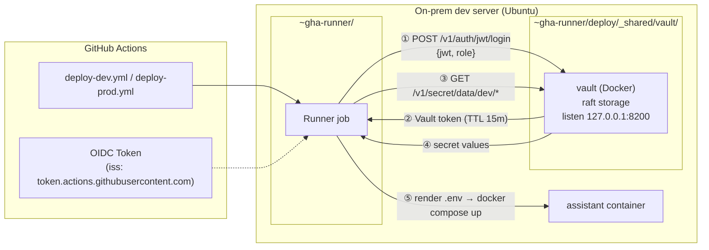

# Phase 4 — Vault-based Secret Management Design

**Status:** Proposal — pending review
**Depends on:** [phase4-cicd.md](./phase4-cicd.md) (self-hosted runner setup)
**Supersedes:** phase4-cicd.md §5.3 "GitHub Secrets-based `.env` rendering" — retained as a historical intermediate stage after Vault is adopted.

---

## 1. Goals

1. **Single source of truth for secrets.** Values currently scattered across `.env` files and GitHub Environment Secrets converge into one Vault instance.
2. **Policy as code.** Who reads which keys is expressed as HCL policy files checked into the repo.
3. **Minimize external attack surface on GitHub.** Even if a GitHub account or an Actions token leaks, long-lived secrets are not directly exposed (short-lived OIDC-based authentication).
4. **Scale to multiple services.** Adding a service means adding KV paths; the JWT auth/policy pattern stays the same.
5. **Bounded operational overhead.** A single on-prem-server instance with manual unseal. Auto-unseal is deferred.
6. **Centralize the app's encryption key.** Replace the app's static `TOKEN_ENCRYPTION_KEY` (AES-256-GCM key for OAuth refresh tokens) with Vault's Transit engine. Key material no longer ships through `.env`.

## 2. Non-goals

- Vault HA cluster. Raft storage is used, but only as a single node. Multi-node is revisited during the K3s migration.
- Dynamic secrets (e.g. on-demand DB credentials). The app currently relies on long-lived API keys only.
- Vault Enterprise features (Namespaces, DR replication, Control Groups, …).

## 3. Why Vault — limits of the current approach

The GitHub Environment Secrets model described in phase4-cicd.md §5.3 has three limitations:

| Limitation | Concrete symptom |
|------------|------------------|
| Management points are scattered | Values are added or rotated only through the GitHub web UI. No automation, audit, or diff. |
| Not reproducible from records | "Which secrets are currently registered in dev?" cannot be answered from Git history. |
| Scalability | For N services × 2 environments × M secrets, manual work in the UI scales as O(N·M). |

Vault lets us check HCL policies and KV path conventions into Git while **keeping the values inside the Vault instance only**. Workflows authenticate short-term with GitHub OIDC and fetch values on demand. The values live in one place; the policies and paths live as code.

## 4. Alternatives considered

| Option | Pros | Cons | Verdict |
|--------|------|------|---------|
| Keep GitHub Environment Secrets | No extra infrastructure | §3 limitations remain | Rejected — blocks long-term scale |
| Infisical (SaaS or self-host) | UI-friendly, official GitHub Action | Requires PostgreSQL even for self-host, less learning material than Vault | Deferred — not a bad fit for simple environments, but the user prefers Vault |
| Doppler (SaaS) | Minimal setup | SaaS lock-in, ongoing cost, no self-host | Rejected — conflicts with homelab philosophy |
| AWS Secrets Manager / GCP Secret Manager | Managed, official OIDC integration | Cloud cost, added network dependency in an on-prem-only environment | Rejected — keeping secrets local on the on-prem server wins on latency and cost |
| **HashiCorp Vault (self-host)** | Industry standard, HCL-first policy (IaC-friendly), native JWT auth for GitHub OIDC | Non-trivial initial setup and unseal discipline | **Selected** |

**Operational comparison (Infisical vs Vault):** both can run as a single Docker node. Differences: (1) Vault uses its built-in `raft` storage, avoiding an external DB such as PostgreSQL; (2) Vault has a seal/unseal concept that requires a one-time manual step at startup (Infisical does not). Phase 4 prioritizes learning and long-term adoption, so we accept Vault's initial friction.

## 5. Architecture overview



**Key property:** Vault binds only to `127.0.0.1:8200` on the on-prem server (no external network exposure). The runner receives the GitHub Actions OIDC token from GitHub and forwards it to local Vault (HTTPS unnecessary; localhost TCP). Vault validates the token, issues a Vault token, and that token can read only the KV paths the policy permits.

## 6. Components

### 6.1 Vault deployment

**Location:** `~gha-runner/deploy/_shared/vault/` (consistent with the `_shared/` layer from phase4-cicd.md §5.2).

**Storage:** `raft` (single node). No external DB dependency. Data is bind-mounted at `./data/`.

**Listener:** `tcp` on `127.0.0.1:8200`, `tls_disable = 1`. No external exposure, and only the same-host runner reaches it, so TLS is omitted for operational simplicity. If remote admin access is ever needed (e.g. over Tailscale), it is added as a separate listener.

**docker-compose.yml sketch:**

```yaml
services:
  vault:
    image: hashicorp/vault:latest
    container_name: vault
    restart: unless-stopped
    cap_add: [IPC_LOCK]
    ports:
      - "127.0.0.1:8200:8200"
    volumes:
      - ./config/vault.hcl:/vault/config/vault.hcl:ro
      - ./data:/vault/data
      - ./audit:/vault/audit
    command: vault server -config=/vault/config/vault.hcl
```

**`config/vault.hcl`:**

```hcl
storage "raft" {
  path    = "/vault/data"
  node_id = "vault-onprem-01"
}

listener "tcp" {
  address     = "0.0.0.0:8200"   # container-internal address; the host binds only on 127.0.0.1
  tls_disable = 1
}

api_addr     = "http://127.0.0.1:8200"
cluster_addr = "http://127.0.0.1:8201"
ui           = true
```

**Initialization flow (one-time):**
1. `docker compose up -d vault`
2. `docker exec -it vault vault operator init -key-shares=1 -key-threshold=1` — outputs the unseal key and root token.
3. Store the unseal key and root token in an **off-host storage** (password manager). Never place them in the repo or under the runner's home directory.
4. Unseal with `vault operator unseal <key>`.
5. Then configure auth (§6.2), policies (§6.3), and secret ingestion (§6.4) once using the root token.

### 6.2 Auth method — JWT / GitHub OIDC

GitHub Actions issues an OIDC ID token for every workflow job (issued by `token.actions.githubusercontent.com`, with claims for repository, ref, environment, etc.). Vault's `jwt` auth method validates that token and issues a Vault token in return.

**Configuration:**

```bash
vault auth enable jwt

vault write auth/jwt/config \
  bound_issuer="https://token.actions.githubusercontent.com" \
  oidc_discovery_url="https://token.actions.githubusercontent.com"

vault write auth/jwt/role/gha-dev \
  role_type="jwt" \
  user_claim="sub" \
  bound_claims_type="glob" \
  bound_claims='{"repository":"Sana-Labo/sanalabo-automation","environment":"dev"}' \
  bound_audiences="https://vault.onprem.local" \
  token_policies="read-dev" \
  token_ttl="15m" \
  token_max_ttl="15m"

vault write auth/jwt/role/gha-prod \
  role_type="jwt" \
  user_claim="sub" \
  bound_claims_type="glob" \
  bound_claims='{"repository":"Sana-Labo/sanalabo-automation","environment":"prod"}' \
  bound_audiences="https://vault.onprem.local" \
  token_policies="read-prod" \
  token_ttl="15m" \
  token_max_ttl="15m"
```

**What `bound_claims` enforces:**
- `repository`: workflows in other repositories cannot reach our dev/prod secrets.
- `environment`: without a GitHub Environment declaration (`environment: dev`) the role match fails. The approval gate in phase4-cicd.md (prod reviewers) participates through this same claim.

The value of `bound_audiences` (`https://vault.onprem.local`) does not need to be an existing host. It is a string the workflow specifies when requesting the OIDC token; matching it 1:1 with a role prevents token reuse across roles.

### 6.3 Policy design

Policies are checked in as HCL files under `policies/` (version-controlled outside the Vault instance).

**`policies/read-dev.hcl`:**

```hcl
path "secret/data/dev/*" {
  capabilities = ["read"]
}

path "secret/metadata/dev/*" {
  capabilities = ["list"]
}
```

**`policies/read-prod.hcl`:** the same shape, with `dev` replaced by `prod`.

**Loading:**

```bash
vault policy write read-dev policies/read-dev.hcl
vault policy write read-prod policies/read-prod.hcl
```

A dev role cannot read prod secrets and vice versa. Isolation is enforced at the path level.

### 6.4 Secret engine — KV v2 path convention

```bash
vault secrets enable -path=secret -version=2 kv
```

**Path convention:** `secret/<env>/<KEY>` — one secret per path. Multi-line blobs are not packed into a single path.

**Initial ingestion (dev example):**

```bash
vault kv put secret/dev/ANTHROPIC_API_KEY value="sk-ant-..."
vault kv put secret/dev/LINE_CHANNEL_ACCESS_TOKEN value="..."
vault kv put secret/dev/LINE_CHANNEL_SECRET value="..."
vault kv put secret/dev/SYSTEM_ADMIN_IDS value="Uxxxxx,Uyyyyy"
vault kv put secret/dev/GOOGLE_CLIENT_ID value="..."
vault kv put secret/dev/GOOGLE_CLIENT_SECRET value="..."
vault kv put secret/dev/GOOGLE_REDIRECT_URI value="..."
vault kv put secret/dev/TOKEN_ENCRYPTION_KEY value="..."
```

Why KV v2: built-in versioning — previous versions are preserved on rotation, so rollback is immediate on an incident. Operational cost is effectively zero.

### 6.5 Transit engine — application encryption service

The app's OAuth refresh-token encryption (currently based on `TOKEN_ENCRYPTION_KEY` with AES-256-GCM — see `src/skills/gws/encryption.ts`) is replaced by Vault Transit's encrypt/decrypt API. Key material never leaves Vault — the app only ships plaintext in and ciphertext out (and vice versa).

**Enable:**

```bash
vault secrets enable transit

vault write -f transit/keys/tokens \
  type=aes256-gcm96 \
  exportable=false \
  deletion_allowed=false
```

- `exportable=false`: the generated key material cannot be exported out of Vault (closes the leak path through the API).
- `deletion_allowed=false`: prevents an accidental key deletion from making existing ciphertexts permanently unreadable.

**Envelope encryption:** internally, Transit manages a two-tier key hierarchy — a master keyring wraps a DEK (data encryption key) freshly generated per operation, and the ciphertext embeds the wrapped DEK. The application is oblivious to this hierarchy; the public API exposes only `encrypt` and `decrypt`.

**Application-only policy** (`policies/app-transit.hcl`):

```hcl
path "transit/encrypt/tokens" {
  capabilities = ["update"]
}

path "transit/decrypt/tokens" {
  capabilities = ["update"]
}
```

Transit's encrypt/decrypt endpoints are invoked with the `update` capability (Vault convention — "write with a response"). `read` is only needed for key metadata and is deliberately withheld from the app.

**App ↔ Vault authentication (delivered in PR 4-a):** a per-environment **vault-agent sidecar** performs AppRole auto-auth and exposes an API proxy listener on `:8100`. The app posts Transit requests to `http://vault-agent:8100/v1/transit/{encrypt,decrypt}/tokens` and never handles a Vault token. See `deploy/_shared/vault-agent/` for the shared service definition and `docs/deployment/vault.md` §3.11 for the AppRole provisioning runbook.

**Rotation:** `vault write -f transit/keys/tokens/rotate`. Existing ciphertexts continue to decrypt against their archived key version (Vault embeds the version number in the ciphertext metadata). Re-encrypting to the latest version is optional — `vault write transit/rewrap/tokens ciphertext=...` produces a rewrap, but correctness is preserved as long as the older versions remain in the archive.

### 6.6 Workflow integration

`hashicorp/vault-action@v3` performs JWT auth and KV v2 fetch in a single step. Example (`deploy-dev.yml`):

```yaml
permissions:
  contents: read
  id-token: write         # required to request the OIDC token

jobs:
  deploy:
    runs-on: [self-hosted, home-server]
    environment: dev       # must match bound_claims.environment on the jwt role
    steps:
      - name: Fetch secrets from Vault
        id: vault
        uses: hashicorp/vault-action@v3
        with:
          url: http://127.0.0.1:8200
          method: jwt
          role: gha-dev
          jwtGithubAudience: https://vault.onprem.local
          exportEnv: false                    # confine values to step outputs, do not spread to process env
          secrets: |
            secret/data/dev/ANTHROPIC_API_KEY value | ANTHROPIC_API_KEY ;
            secret/data/dev/LINE_CHANNEL_ACCESS_TOKEN value | LINE_CHANNEL_ACCESS_TOKEN ;
            secret/data/dev/LINE_CHANNEL_SECRET value | LINE_CHANNEL_SECRET ;
            secret/data/dev/SYSTEM_ADMIN_IDS value | SYSTEM_ADMIN_IDS ;
            secret/data/dev/GOOGLE_CLIENT_ID value | GOOGLE_CLIENT_ID ;
            secret/data/dev/GOOGLE_CLIENT_SECRET value | GOOGLE_CLIENT_SECRET ;
            secret/data/dev/GOOGLE_REDIRECT_URI value | GOOGLE_REDIRECT_URI ;
            secret/data/dev/TOKEN_ENCRYPTION_KEY value | TOKEN_ENCRYPTION_KEY ;

      - name: Render .env
        env:
          ANTHROPIC_API_KEY: ${{ steps.vault.outputs.ANTHROPIC_API_KEY }}
          LINE_CHANNEL_ACCESS_TOKEN: ${{ steps.vault.outputs.LINE_CHANNEL_ACCESS_TOKEN }}
          LINE_CHANNEL_SECRET: ${{ steps.vault.outputs.LINE_CHANNEL_SECRET }}
          SYSTEM_ADMIN_IDS: ${{ steps.vault.outputs.SYSTEM_ADMIN_IDS }}
          GOOGLE_CLIENT_ID: ${{ steps.vault.outputs.GOOGLE_CLIENT_ID }}
          GOOGLE_CLIENT_SECRET: ${{ steps.vault.outputs.GOOGLE_CLIENT_SECRET }}
          GOOGLE_REDIRECT_URI: ${{ steps.vault.outputs.GOOGLE_REDIRECT_URI }}
          TOKEN_ENCRYPTION_KEY: ${{ steps.vault.outputs.TOKEN_ENCRYPTION_KEY }}
        run: |
          umask 077
          {
            printf 'ANTHROPIC_API_KEY=%s\n' "$ANTHROPIC_API_KEY"
            printf 'LINE_CHANNEL_ACCESS_TOKEN=%s\n' "$LINE_CHANNEL_ACCESS_TOKEN"
            printf 'LINE_CHANNEL_SECRET=%s\n' "$LINE_CHANNEL_SECRET"
            printf 'SYSTEM_ADMIN_IDS=%s\n' "$SYSTEM_ADMIN_IDS"
            printf 'GOOGLE_CLIENT_ID=%s\n' "$GOOGLE_CLIENT_ID"
            printf 'GOOGLE_CLIENT_SECRET=%s\n' "$GOOGLE_CLIENT_SECRET"
            printf 'GOOGLE_REDIRECT_URI=%s\n' "$GOOGLE_REDIRECT_URI"
            printf 'TOKEN_ENCRYPTION_KEY=%s\n' "$TOKEN_ENCRYPTION_KEY"
            printf 'PORT=3000\n'
          } > "$DEPLOY_DIR/.env"
          chmod 600 "$DEPLOY_DIR/.env"
```

> **Note (post PR 4-a state):** the workflow snippet above is the historical PR 3 shape. In the live workflow the `TOKEN_ENCRYPTION_KEY` lines are gone — at-rest encryption is handled by the vault-agent sidecar via Transit (§6.5). Instead, the workflow fetches `VAULT_ROLE_ID` / `VAULT_SECRET_ID` from KV and renders them into `$DEPLOY_DIR/vault-secrets/` for the sidecar's AppRole auto-auth. See `.github/workflows/deploy-dev.yml` (and `deploy-prod.yml`) for the current form.

**Security properties:**
- Values fetched by vault-action are automatically masked in GitHub Actions logs.
- The Vault token is job-scoped and expires in 15 minutes — meaningless once the workflow finishes (cannot be reused).
- `.env` is created under `umask 077` with mode 0600.
- The OIDC token is freshly issued by GitHub for every job — no value reuse is possible.

### 6.7 Unseal strategy

**Initial (Phase 4):** manual unseal. When the Vault container starts, the operator pulls the unseal key from Apple Keychain on the operator's macOS workstation and forwards it to the on-prem server once.

```bash
# on the operator's macOS
UNSEAL_KEY=$(security find-generic-password -a vault-admin -s onprem-vault-unseal-key -w)
ssh timothy-dev-ts "docker exec vault vault operator unseal $UNSEAL_KEY"
```

Key storage: `security add-generic-password -a vault-admin -s onprem-vault-unseal-key -w <key> -U` (detailed procedure in [docs/deployment/vault.md](../deployment/vault.md)). Loss resilience comes from iCloud Keychain syncing across every Apple device signed in with the same Apple ID.

Side effect: deployment fails immediately after a reboot, which enforces the explicit "deploy fails → SSH → unseal → re-deploy" recovery loop. Better for learning than full automation.

**Long term:** two auto-unseal candidates — both out of Phase 4 scope.
1. **Transit seal** — run a separate Vault instance dedicated to Transit and use it to auto-unseal the main instance. Redundancy value is weak on a single on-prem server.
2. **Cloud KMS** (AWS KMS / GCP KMS) — introduces a cloud dependency; a trade-off against the homelab philosophy.

### 6.8 Backups

**Mechanism:** the raft `snapshot` command.

```bash
vault operator raft snapshot save /backup/vault-$(date +%Y%m%d).snap
```

**Schedule:** once daily via cron; retained for 7 days. Snapshot files are encrypted, so they cannot be read without the unseal key.

**Restore rehearsal:** performed at least once in Phase 4 (included in a follow-up PR after this design). A backup that has not been restored is not a backup.

## 7. Operations

### 7.1 Rotation

1. `vault kv put secret/dev/<KEY> value="<new>"` (KV v2 preserves previous versions automatically).
2. Re-run the workflow (push an empty commit to `develop`, or trigger a re-run from the Actions UI).
3. `.env` is re-rendered with the new value; the container is restarted.

Rotation does not require entering the GitHub web UI. Value history is inspected via `vault kv metadata get secret/dev/<KEY>`.

### 7.2 Audit

Enable the file audit device at `audit/`:

```bash
vault audit enable file file_path=/vault/audit/vault.log
```

Every secret read from GitHub Actions is recorded as JSON in `vault.log`. Used during leak investigations.

## 8. Security considerations

| Concern | Mitigation |
|---------|-----------|
| Vault unseal key leak | Kept only in Apple Keychain on the operator's macOS. Never placed on the on-prem server (runner home included) — neither plaintext nor encrypted. Keychain access is gated by the macOS login session. |
| Long-lived use of the Vault root token | Root token is revoked after bootstrap. Further admin work uses a separately issued token under an admin policy. |
| OIDC subject-claim spoofing | `bound_claims.repository` + `bound_claims.environment` accept only jobs from our repo in the intended environment. |
| vault-action exposing fetched values in logs | GitHub Actions masking + `exportEnv: false` (confined to step outputs). |
| Vault container crash → deployment blocked | Intentional behavior. Unseal + restart runbook documented. |
| A compromised runner querying Vault | Policy is scoped to the job's environment; a dev runner cannot read prod secrets. |
| Backup file leak | Backups are encrypted raft snapshots. Useless without the unseal key. |

## 9. Migration plan

| PR | Content | Verification |
|----|---------|--------------|
| 1 | **This design doc** (adds phase4-vault.md + updates phase4-cicd.md §5.3 note) | Review approved |
| 2 | `~gha-runner/deploy/_shared/vault/` compose + config + policies directory + operations runbook (`docs/deployment/vault.md`) | `vault status` reports unsealed on the on-prem server |
| 3 | Load 8 dev secrets into Vault + configure jwt role `gha-dev` + rewrite `deploy-dev.yml` (vault-action based) | develop push → deploy succeeds, `.env` is rendered from Vault values |
| 4 | Load prod secrets + `gha-prod` role + rewrite `deploy-prod.yml` + approval gate | main merge → prod deploy succeeds after approval |
| 4-a | Implement `VaultTransitEncryption` in the app, add a per-environment vault-agent sidecar (AppRole auto-auth + API proxy), remove `AesGcmEncryption` and `TOKEN_ENCRYPTION_KEY` from the app, workflow, and `.env`. Live Google OAuth tokens at the time of the cutover are empty (`data/workspaces/*/google-tokens.enc` absent), so no ciphertext migration is needed. | Newly issued refresh tokens are encrypted via Transit and persisted. App container holds no Vault token; vault-agent owns auth and renewal. |
| 4-b | Retired — the AES → Transit ciphertext migration step is subsumed by 4-a because no AES-encrypted tokens exist at cutover. If any pre-existing `google-tokens.enc` files resurface (e.g. restore from a stale backup), they are rejected by `JsonFileTokenStore.load` and the user re-authorizes GWS through the normal `authenticate_gws` flow. | n/a |
| 5 | Enable audit device + snapshot cron + restore rehearsal report | Backup files present + successful restore log |

**Handling of PR #53 (individual-secret refactor):** keep as draft → close when PR 3 merges. Its workflow changes are subsumed by PR 3's vault-action rewrite, so there is no independent merge value.

**Rollback path:** back up individual secret values (matching what is in Vault) into a password manager so that a Vault outage allows temporary reversion to GitHub Environment Secrets. Emergency recovery is then a single PR switching the workflow back to GitHub Secrets fetch.

## 10. Risks and mitigations

| Risk | Impact | Mitigation |
|------|--------|-----------|
| Missed unseal after a reboot → deploys blocked | Both dev and prod halted | `docker compose up` auto-starts via a systemd override. The unseal is a one-time SSH step by the operator. Deploy-failure LINE notifications handle operator alerting (phase4-cicd.md §5.6). |
| A Vault bug corrupts data | All secrets lost | Daily snapshot + off-site backup |
| GitHub OIDC issuer/format changes | All workflows fail authentication | vault-action tracks the upstream officially. Because the setup is based on `oidc_discovery_url`, the fix is on the Vault side |
| Single-operator setup loses the unseal key | Permanent data loss | Initialize with `-key-shares=1 -key-threshold=1` (distributed custody is impractical for a solo operator with no three physical locations). Loss resilience comes from iCloud Keychain sync replicating across multiple Apple devices. Worst case (complete Apple ID loss): reissue all API keys and re-initialize Vault (~30–60 minutes). |
| Excessive Vault operational load | Time sink | Minimal shape — single node + raft. Auto-unseal / HA deferred deliberately. |

## 11. Decisions needed

Items to confirm during the design review.

1. **Unseal key shares** (decided) — `-key-shares=1 -key-threshold=1`. Distributing 3 shares is impractical for a solo operator (no three physical custody locations). Single-key loss tolerance is covered by iCloud Keychain sync, which gives multi-device recovery.
2. **Vault Web UI access path** — with the listener bound to `127.0.0.1` only, UI access is either (a) SSH port-forwarding or (b) a dedicated Tailscale listener. Choose based on operational ergonomics.
3. **Snapshot storage location** — local-only on the on-prem server (lost together with the host on failure) vs. syncing to something like Cloudflare R2. Backup philosophy decision.
4. **Audit log retention** — 30 days / 90 days / unlimited. Trade off disk usage vs incident-investigation needs.
5. **Vault-managed `TOKEN_ENCRYPTION_KEY`** (decided) — moved to Vault Transit (§1 Goal #6, §6.5). The `.env` render path is removed. PR 4-a delivers the transition in one step (`VaultTransitEncryption` + vault-agent sidecar + AppRole provisioning + AES removal). PR 4-b is retired because no AES ciphertext exists at cutover (§9).
6. **App ↔ Vault auth method** (decided) — vault-agent sidecar with AppRole auto-auth, one role per environment. App posts to the agent's API proxy listener on `:8100` and never handles a Vault token. Rationale: direct AppRole in the app would require rotating the auth code when we move off the single-host compose (K3s is on the 2026 roadmap); pinning the auth boundary to a sidecar keeps the app unchanged across those transitions.

## 12. References

- [HashiCorp Vault — JWT/OIDC auth method](https://developer.hashicorp.com/vault/docs/auth/jwt)
- [HashiCorp Vault — KV v2 secrets engine](https://developer.hashicorp.com/vault/docs/secrets/kv/kv-v2)
- [HashiCorp Vault — raft integrated storage](https://developer.hashicorp.com/vault/docs/configuration/storage/raft)
- [hashicorp/vault-action](https://github.com/hashicorp/vault-action)
- [GitHub Docs — OIDC with HashiCorp Vault](https://docs.github.com/en/actions/deployment/security-hardening-your-deployments/configuring-openid-connect-in-hashicorp-vault)
- [GitHub Docs — About security hardening with OpenID Connect](https://docs.github.com/en/actions/deployment/security-hardening-your-deployments/about-security-hardening-with-openid-connect)
- Related repo docs: [phase4-cicd.md](./phase4-cicd.md), [deployment/ci-secrets.md](../deployment/ci-secrets.md) (intermediate stage, superseded by PR 3)
