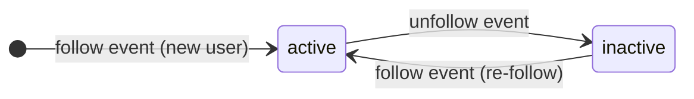

# Workspace Tools Reference

Workspaces are managed through **System Tools** invoked by the agent during a LINE conversation.
These are not direct API endpoints — the agent decides when to call them based on the user's message.

---

## Workspace & Navigation

| Tool | Who | Description |
|------|-----|-------------|
| `create_workspace` | Any user | Create a new workspace (1 per user; admins can specify `owner_user_id`) |
| `list_workspaces` | Any user | List workspaces (admin: all; regular user: owned only) |
| `get_workspace_info` | Any user | View workspace details |
| `enter_workspace` | Any member | Enter a workspace to start working — GWS tools become available after entering |
| `leave_workspace` | Any member | Leave the current workspace and return to workspace selection |

---

## Member Management

| Tool | Who | Description |
|------|-----|-------------|
| `invite_member` | Owner / Admin | Invite a user by LINE userId — added as member immediately |

---

## Approval Flow

Write operations from Members are intercepted and require Owner approval before execution.

| Tool | Who | Description |
|------|-----|-------------|
| `approve_action` | Owner | Approve a pending write action — executes immediately and notifies the requester |
| `reject_action` | Owner | Reject a pending write action — notifies the requester with an optional reason |

---

## Google Workspace Authentication

| Tool | Who | Description |
|------|-----|-------------|
| `authenticate_gws` | Owner / Admin | Send a Google OAuth link for initial or full re-authentication |
| `request_gws_scopes` | Owner / Admin | Request additional permissions for missing service scopes only (Gmail / Calendar / Drive) |

---

## User Lifecycle

Only `active` users can trigger the agent loop. `inactive` users have unfollowed the bot and are silently ignored until they re-follow.

---

## Tool Definitions in Code

All tool schemas are defined with Zod 4 as the single source of truth:

- System tools: [`src/agent/system-tools.ts`](../../src/agent/system-tools.ts)
- Infrastructure / discovery tools: [`src/agent/infra-tools.ts`](../../src/agent/infra-tools.ts)
- GWS tools: [`src/skills/gws/gmail-tools.ts`](../../src/skills/gws/gmail-tools.ts), [`calendar-tools.ts`](../../src/skills/gws/calendar-tools.ts), [`drive-tools.ts`](../../src/skills/gws/drive-tools.ts)
- LINE MCP adapter: [`src/agent/line-tool-adapter.ts`](../../src/agent/line-tool-adapter.ts)
