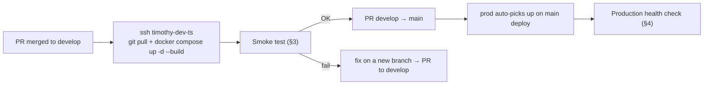

# Testing

Three complementary layers of verification:

1. **Unit & type check** — fast, run locally before every commit
2. **Local smoke test** — exercises the full stack on your machine with a real LINE Bot
3. **Test server (dev) smoke test** — verifies the `develop`-deployed environment on the company dev server

Production verification is intentionally minimal: only health checks. All feature testing happens against dev.

---

## 1. Unit & Type Check

Run these before every commit. Both must pass.

```bash
bun run typecheck    # Type check (tsc --noEmit)
bun test             # Run all tests
bun test src/utils/error.test.ts   # Run a specific file
```

Tests are co-located with source files (`*.test.ts`) and follow TDD (Red → Green → Refactor).

| Category | Scope | Strategy |
|----------|-------|----------|
| Pure logic | `domain/*`, access, error, LINE parsing, system prompt | Direct calls, no mocks |
| Store I/O | `JsonFileStore`, `UserStore`, `WorkspaceStore`, `PendingActionStore` | Real file I/O in `$TMPDIR` |
| Business logic | interceptor, notifications, executor caching | Mock stores / registries |
| HTTP | health route, OAuth callback | Hono `app.request()` |

---

## 2. Local Smoke Test

Exercises the full stack on your machine against a real LINE Bot channel. Use this before pushing to `develop`.

### Prerequisites

- [Local development environment](./setup/local-development.md) set up
- ngrok static domain and LINE Bot channel already configured

### Procedure

1. **Start the server + tunnel**

   ```bash
   # Terminal 1
   bun run dev

   # Terminal 2
   ngrok http --domain=<your-static-domain>.ngrok-free.app 3000
   ```

2. **Health check**

   ```bash
   curl http://localhost:3000/health
   # → { "status": "ok", ... }
   ```

3. **LINE Webhook verification**

   In the LINE Developers Console → Messaging API tab, click **Verify**. It must return `Success`.
   Failures here usually mean:
   - Server not running on port 3000
   - ngrok tunnel not active
   - Webhook URL missing `/webhook/line` suffix

4. **Bot round-trip**

   Send any text message from the LINE app to your bot. Verify in server logs:
   - Webhook event received
   - Agent loop executed
   - Response pushed back via LINE MCP Pool

5. **GWS flow (if configured)**

   Ask the bot to `authenticate_gws`, complete OAuth in the browser, then try a read tool (e.g. "list my recent emails"). Confirm tokens are encrypted and persisted.

### What to watch for

- **MCP Pool cold start**: the first LINE push after server start may be slow (~5–10 s). Subsequent pushes should be fast.
- **Signature errors**: every incoming Webhook is HMAC-verified. A secret mismatch silently rejects all traffic.
- **Debug logs**: set `LOG_LEVEL=debug` to see the full tool-use loop, incoming events, and MCP dispatch decisions.

---

## 3. Test Server (dev) Smoke Test

After merging to `develop`, verify the deployed dev environment end-to-end.

### Access

```bash
ssh timothy-dev-ts                               # Tailscale-based SSH
cd ~/deploy/sanalabo-automation/dev
```

### Deploy the latest develop

```bash
git pull origin develop
docker compose up -d --build assistant
```

`docker compose up -d` is required to pick up any `.env` changes. `docker compose restart` will **not** reload environment variables.

### Verify

1. **Container & tunnel**

   ```bash
   docker compose ps
   # Both `assistant` and `tunnel` should be Up / healthy
   ```

2. **Health check**

   ```bash
   docker compose exec assistant wget -qO- http://localhost:3000/health
   # Or externally via the Cloudflare Tunnel hostname
   ```

3. **Logs**

   ```bash
   docker compose logs -f --tail=100 assistant
   ```

4. **Bot round-trip via dev LINE channel**

   The dev LINE Bot channel is separate from prod. Send a message from your LINE app (the dev bot must be added as a friend) and confirm the response. Repeat the local smoke test's bot round-trip steps here.

5. **GWS flow**

   If this deploy changed anything about OAuth, Gmail, Calendar, or Drive tools, rerun the GWS round-trip.

### Troubleshooting

| Symptom | Likely cause | Fix |
|---------|-------------|-----|
| `no such service: app` | Service name is `assistant`, not `app` | Use `docker compose logs assistant` |
| `.env` changes not taking effect | Used `restart` instead of `up -d` | `docker compose up -d assistant` |
| Webhook `signatureInvalid` | `LINE_CHANNEL_SECRET` mismatch | Re-copy from the LINE Developers Console |
| `model: String should have at least 1 character` | Empty-string env var overriding default | Remove the empty entry from `.env` (see [Environment Variables](./setup/environment-variables.md) notes) |

---

## 4. Production Verification

Production (`main` branch, `agent.sanalabo.com`) is verified only through light checks after each deploy.

- Container health: `docker compose ps` on the prod server
- Endpoint: `curl https://agent.sanalabo.com/health`
- Cron jobs: confirm first post-deploy morning briefing fires at 08:00 (weekday)

Do not run feature tests directly against prod. All functional verification happens on dev.

---

## Deploy → Verify Loop

Typical flow after a feature PR is merged to `develop`:


